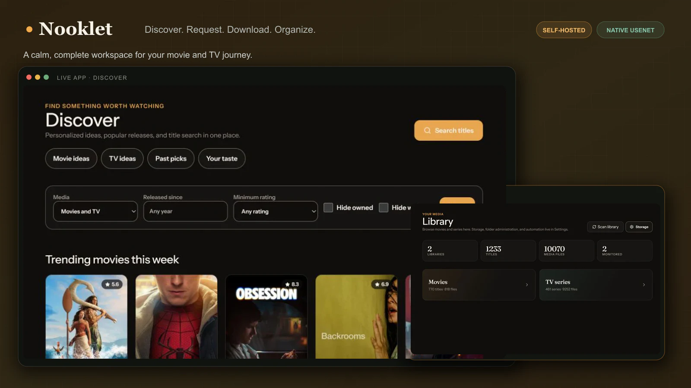
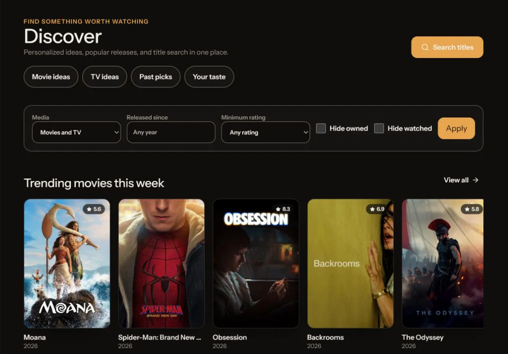
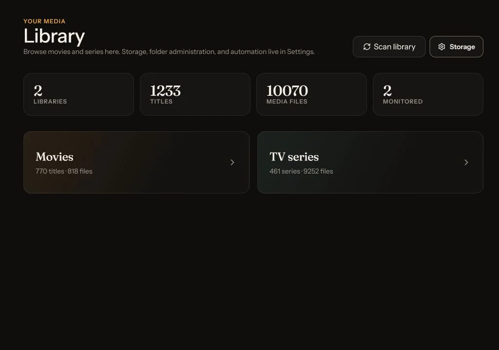

<div align="center">

# Nooklet

**Discover, request, download, and organize movies and TV from one self-hosted app.**

Native Usenet downloading, intelligent recommendations, and clear operational status—without requiring a separate media manager.

[](https://github.com/TannerMidd/Nooklet/actions/workflows/ci.yml)
[](https://tannermidd.github.io/Nooklet/)

[](LICENSE)

[Explore features](https://tannermidd.github.io/Nooklet/features/) · [Open the user guide](https://tannermidd.github.io/Nooklet/guide/) · [Read the Wiki](https://github.com/TannerMidd/Nooklet/wiki) · [Explore the architecture](https://tannermidd.github.io/Nooklet/) · [Report an issue](https://github.com/TannerMidd/Nooklet/issues)



</div>

## One app, the whole journey

| Discover confidently | Request in one flow | Operate without guesswork |
| :--- | :--- | :--- |
| Search TMDB, explore current releases, and use optional AI recommendations shaped by your taste. | Choose a movie, season, or episode and follow it from release search through download and import. | See storage readiness, downloader health, queue state, and the right recovery action when work needs attention. |

Nooklet brings the full media workflow into one coherent interface. Plex, Tautulli, Trakt, Discord, Apprise, and webhooks are optional integrations—the download path itself is built in.

## See Nooklet in action

| Discovery | Library |
| :---: | :---: |
|  |  |
| Browse personalized ideas, public catalog trends, and title search from one focused workspace. | Understand the state of every library, title, media file, and monitored item at a glance. |

## What is included

| Product experience | Media engine |
| :--- | :--- |
| TMDB discovery, search, artwork, cast, trailers, and watch-provider context | Direct Newznab search with movie, season, and episode request flows |
| Optional recommendations from any OpenAI-compatible provider | Native NNTP downloading with persisted queue state, pause/resume, verified cancellation, and restart-safe recovery |
| Movie and TV library views with scanning, monitoring, and file awareness | PAR2 verification and repair, archive extraction, and organized imports |
| Guided setup, storage preflight, diagnostics, audit history, and recovery actions | One built-in downloader plus optional Plex, Tautulli, and Trakt context |

## Run Nooklet

Docker Compose is the recommended installation path. It packages the web app, background worker, SQLite database, downloader, PAR2, UnRAR, and 7-Zip into one reproducible deployment.

Prerequisites: Docker Engine with Docker Compose v2, Git, writable media-library folders, and enough Docker or host storage for downloader work. A dedicated bind-mounted staging folder is recommended when the Docker data volume is not large enough.

### 1. Clone and prepare the environment

```bash
git clone https://github.com/TannerMidd/Nooklet.git
cd Nooklet
cp .env.example .env
```

On Windows PowerShell, use `Copy-Item .env.example .env` for the final command. In `.env`, set three independent random values for `AUTH_SECRET`, `BOOTSTRAP_TOKEN`, and `SECRET_BOX_KEY`. The [Docker installation guide](https://github.com/TannerMidd/Nooklet/wiki/Docker-Installation) includes copy-and-paste secret generators for every platform.

### 2. Mount your storage

Create the host folders first, then add a machine-specific `docker-compose.override.yml`:

```yaml
services:
  app:
    volumes:
      - "/srv/media/tv:/media/tv"
      - "/srv/media/movies:/media/movies"
      - "/srv/nooklet-downloads:/downloads"
```

Use quoted forward-slash paths on Windows, such as `"F:/Nooklet/Downloads:/downloads"`. Then set `DOWNLOAD_ENGINE_DIR=/downloads/nooklet-engine` and `APPROVED_MEDIA_ROOTS=/media` in `.env`.

### 3. Start the app

```bash
docker compose config --quiet
docker compose up -d --build
docker compose ps
```

Open [http://localhost:42021](http://localhost:42021), enter the bootstrap token, and create the first administrator. Setup Center then verifies TMDB, indexers, downloading, storage, and the background worker against the real request path.

After the administrator exists, clear `BOOTSTRAP_TOKEN` in `.env` and recreate the container so the one-time bootstrap route is disabled.

**Next:** follow the [first-time setup guide](https://github.com/TannerMidd/Nooklet/wiki/First-Time-Setup) or open the full [Docker installation guide](https://github.com/TannerMidd/Nooklet/wiki/Docker-Installation) for NAS mounts, reverse proxies, Windows paths, and production hardening.

## Storage paths, without surprises

> [!IMPORTANT]
> Nooklet runs inside Docker, so the app uses container paths—not Windows drive letters or host paths. If `F:/Nooklet/Downloads` is mounted as `/downloads`, configure Nooklet with `/downloads`. The built-in engine checks both its in-flight workspace (`DOWNLOAD_ENGINE_WORK_DIR`) and completed-output staging (`DOWNLOAD_ENGINE_DIR`); the filesystem with less usable capacity limits admission. Neither is the final movie or TV destination.

If a request reports insufficient space, open **Settings → Storage** and inspect both effective engine paths. Environment or bind-mount changes require `docker compose up -d --force-recreate`.

See [Storage and path mapping](https://github.com/TannerMidd/Nooklet/wiki/Storage-and-Path-Mapping) for capacity rules, NAS examples, engine staging, and permissions.

## Documentation and architecture

- **[Feature guide](https://tannermidd.github.io/Nooklet/features/)** — a visual tour of discovery, requests, resilient seasons, native downloads, Library, and operations.
- **[User guide](https://tannermidd.github.io/Nooklet/guide/)** — the clean path from installation to a first request, daily use, and symptom-first recovery.
- **[Wiki](https://github.com/TannerMidd/Nooklet/wiki)** — task-oriented installation, setup, operation, backup, upgrade, and troubleshooting guides.
- **[Engineering dossier](https://tannermidd.github.io/Nooklet/)** — source-backed architecture diagrams, capacity charts, trust boundaries, and release evidence.
- **[Architecture](https://github.com/TannerMidd/Nooklet/wiki/Architecture)** — runtime structure, domain boundaries, persistence, jobs, and integrations.
- **[Security model](https://github.com/TannerMidd/Nooklet/wiki/Security-Model)** — authentication, encrypted secrets, filesystem boundaries, and outbound-request controls.

## Development

Nooklet requires Node.js `>=24.15.0` and npm for local development.

```bash
npm ci
npm run dev
npm test
```

Use `npm run check` for the complete documentation, migration-history, module-boundary, type, lint, test, and production-build gate. `npm run test:e2e` exercises first-admin bootstrap, login, and a serious/critical accessibility smoke in Chromium. Contributor conventions and migration guidance live in the [development guide](https://github.com/TannerMidd/Nooklet/wiki/Development-Guide).

## Security and license

Report vulnerabilities through a [private GitHub security advisory](https://github.com/TannerMidd/Nooklet/security/advisories/new), not a public issue. Nooklet is released under the [MIT License](LICENSE).
