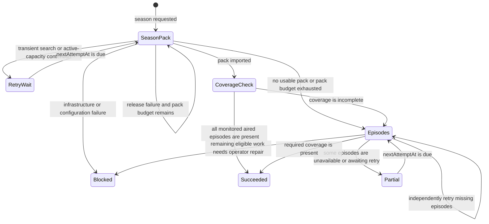

# ADR-0003: Durable Season Fulfillment

## Status

Accepted

## Date

2026-07-16

## Context

A request for a television season expresses an outcome: obtain the missing,
monitored episodes of that season. It does not express a requirement to use one
particular season-pack release.

Representing that intent only as a `download_requests` row made the workflow
brittle. A failed pack could be replaced by another physical request, but there
was no durable record connecting those attempts, no transition to individual
episodes when packs were unavailable, and no persisted schedule from which the
worker could resume recovery after a restart. Historical attempts could also
consume a later request's retry budget because exclusions were scoped to the
media item rather than to one fulfillment plan.

The workflow must remain conservative around operator-controlled
infrastructure. A damaged, unavailable, or intrinsically oversized release is a
reason to try different content. A staging filesystem that is currently full or
mapped to the wrong volume, an invalid destination, an unavailable downloader,
or a broken credential is not: multiplying episode requests cannot repair those
conditions and can make the failure harder to understand.

## Decision

Model a season request as a durable fulfillment plan that coordinates one or
more physical download attempts.

### Persisted model

- `download_fulfillments` stores the season-level user intent, selected
  destination, current strategy, aggregate status, pack-attempt budget, next
  attempt time, and operator-visible status message.
- `download_fulfillment_episodes` stores the independent state and next attempt
  time for each episode considered by fallback.
- `download_requests` remains the record of one physical release attempt. Its
  optional fulfillment, strategy, and attempt-number fields connect evidence to
  the plan without changing the request/import lifecycle.
- At most one open fulfillment exists for a user, title, and season. Repeated
  submissions converge on that plan instead of creating competing coordinators.

The plan is the Activity-level unit. Individual request rows remain available
as attempt history and technical evidence.

### Strategy and state transitions

The season-pack strategy may submit at most three automatic physical release
attempts for a fulfillment. Previously attempted result identifiers and stable
release keys are excluded within that fulfillment. A successful pack import is
not assumed to be complete; the workflow reconciles the library against current
episode metadata and falls back for any missing coverage.

If no matching pack exists, all pack alternatives are exhausted, or a pack is
usable but incomplete, the plan switches to the episode strategy. Fallback:

- treats episodes already in the library as succeeded;
- leaves future or unmonitored episodes deferred;
- attaches to compatible work that is already active;
- searches missing, monitored, aired episodes independently, with bounded
  concurrency;
- records release exclusions and retry state per episode; and
- completes only when current monitored, aired coverage is present.

### Failure classification

Recovery is driven by the failure boundary, not by one generic retry flag.

| Failure class                | Examples                                                                                                                                    | Plan behavior                                                                                             |
| ---------------------------- | ------------------------------------------------------------------------------------------------------------------------------------------- | --------------------------------------------------------------------------------------------------------- |
| Release/content              | unavailable NZB, failed transfer, unusable files, release larger than the entire staging filesystem                                         | Exclude that release, try an alternate, then fall back to episodes                                        |
| Transient search/runtime     | indexer search error, unexpected recoverable workflow error, capacity reserved by active downloads                                          | Persist `retry_wait` and a due time without consuming the release                                         |
| Conflict/coverage            | equivalent request already active                                                                                                           | Track the active work and recheck coverage later                                                          |
| Infrastructure/configuration | insufficient non-active free space, wrong staging mount, destination path, downloader connection, credentials, no compatible Newznab source | Stop automatic fan-out without consuming the release and surface a blocked plan requiring operator action |

Immediate alternatives are bounded. An episode that exhausts them becomes
temporarily unavailable and is searched again on a later cooldown rather than
being abandoned permanently.

### Worker and restart recovery

The existing 15-second maintenance pass scans due open fulfillments after
download import and reconciliation. `nextAttemptAt` makes transient schedules
restart-safe: the delay begins at five minutes, doubles after repeated failures,
and is capped at six hours. Active-coverage checks run after 15 minutes, and
unavailable-release checks run after six hours.

A shared renewable 15-minute fulfillment-work lease prevents interactive,
import, and maintenance entry points from advancing the same plan concurrently.
If a process stops, the lease expires and a later maintenance pass can reclaim
the due plan.

No new external queue or worker service is introduced. The coordinator follows
the single-container model established by ADR-0001 and uses SQLite as its source
of truth.

### Notifications and presentation

Activity groups physical requests by fulfillment and shows the aggregate plan as
recovering while automatic work remains open. Failed attempts are retained as
evidence but do not present the season as terminal. Lifecycle notifications are
suppressed while a plan is still recovering and are emitted only for a meaningful
terminal outcome.

## Alternatives considered

### Keep retrying `download_requests` only

Rejected because request rows describe attempts, not the user's season outcome.
They cannot reliably express pack-to-episode transition, plan-scoped exclusions,
or restart-safe per-episode schedules.

### Always request individual episodes

Rejected as the default because a healthy pack is more efficient for indexer,
queue, and transfer overhead. Individual episodes remain the redundancy path and
the mechanism for filling incomplete coverage.

### Retry season packs indefinitely

Rejected because repeatedly selecting equivalent content delays useful fallback
and can generate unbounded load. A small explicit budget gives packs a fair
chance while guaranteeing progress to the alternative strategy.

### Fan out on every error

Rejected because infrastructure failures affect every child request. Automatic
fan-out is reserved for content/release failures. Capacity reserved by active
downloads waits automatically; a release that cannot fit the entire staging
filesystem is treated as content; current free-space or mount problems require
an operator-visible stop.

## Consequences

### Positive

- A season request survives failed releases and process restarts as one durable
  user intent.
- No-pack and incomplete-pack cases automatically converge on per-episode work.
- Retries exclude only attempts made by the current plan instead of unrelated
  historical requests.
- Activity can explain strategy, progress, ruled-out attempts, and the next
  recovery boundary without requiring manual retries.
- Existing files and active episode requests are reused rather than duplicated.

### Negative

- Two additional tables and coordinator states increase schema and workflow
  complexity.
- Episode fallback can create several physical requests from one user action and
  therefore requires bounded search concurrency and grouped presentation.
- Availability is not a permanent terminal fact; cooldown rechecks intentionally
  keep partially fulfilled plans open.

### Risks to manage

- Failure classification must remain conservative. Misclassifying an
  infrastructure error as a release error could create wasteful fan-out.
- Episode metadata and monitoring changes can alter the definition of current
  season coverage; reconciliation must always read current owned records.
- Notification and Activity queries must use the aggregate plan so an internal
  failed attempt is not reported as the user's final outcome.
- New retry entry points must preserve exact episode scope and must never submit
  both season and episode identifiers to a workflow that accepts one scope.
- Capacity classification must preserve current free space, total filesystem
  capacity, and active workspace usage so a valid release is not excluded for a
  repairable drive or mount condition.

## Related

- [`ADR-0001-architecture-principles.md`](ADR-0001-architecture-principles.md)
- [`ADR-0002-in-house-download-engine.md`](ADR-0002-in-house-download-engine.md)
- [`docs/wiki/Downloads-and-Import.md`](../wiki/Downloads-and-Import.md)
