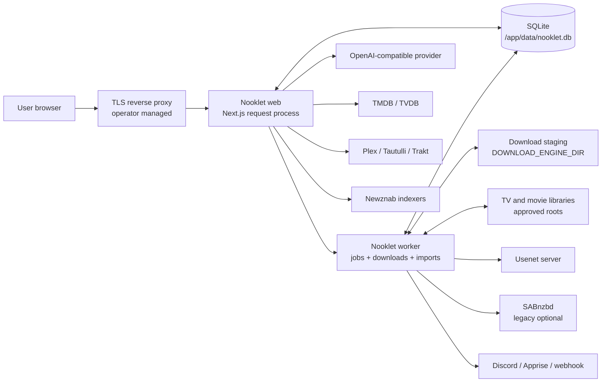
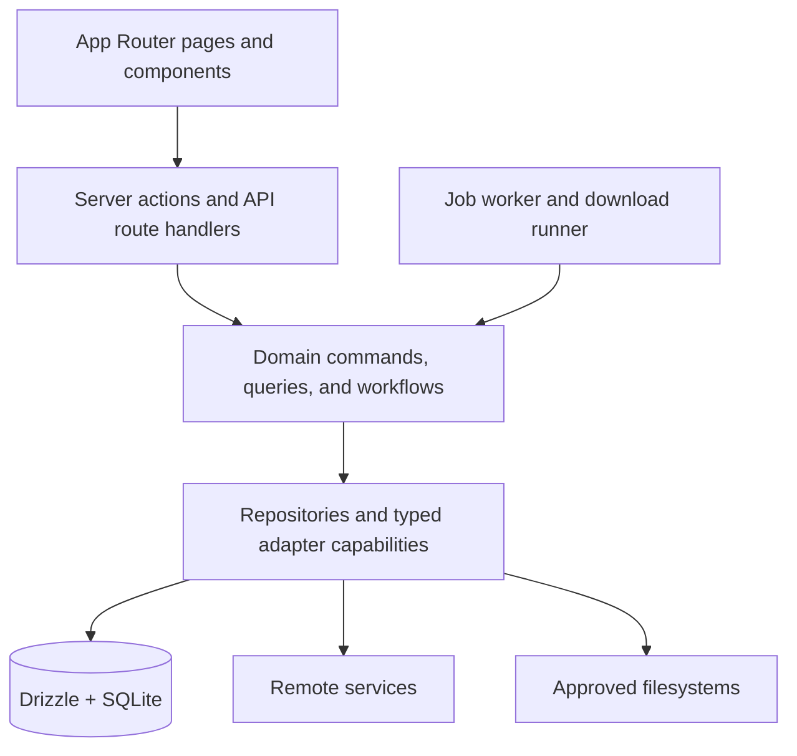
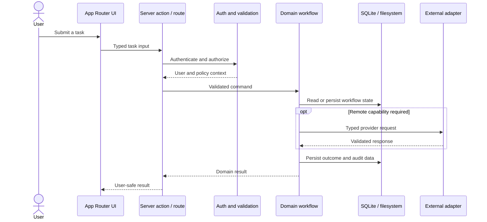
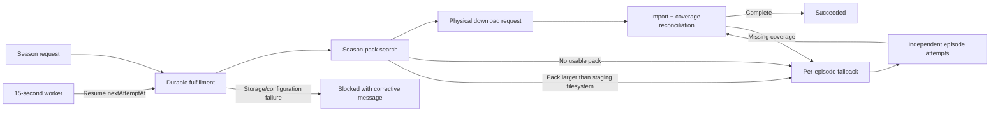
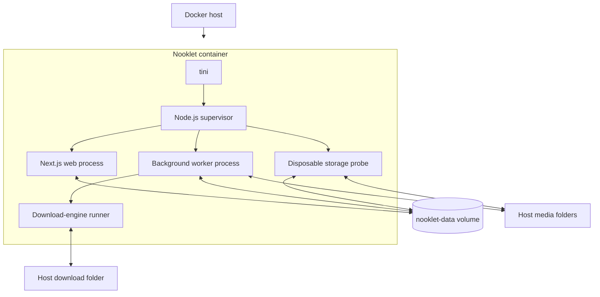

# Architecture

> Applies to the current `main` implementation. Last source review: 2026-07-20.

Nooklet is a supervised, single-container application with separate Node.js processes for the Next.js web server and background worker. SQLite is the durable system of record and the cross-process coordination boundary; media and download files remain on operator-controlled filesystems. This separation keeps the UI available when an unhealthy Docker Desktop bind mount blocks a worker-side filesystem call.

For repository metrics and deeper implementation evidence, see the [engineering dossier](https://tannermidd.github.io/Nooklet/). For the decisions that shaped this design, see [Architecture Decisions](Architecture-Decisions).

## System context

The reverse proxy is not included in the shipped container. Operators exposing Nooklet beyond loopback are responsible for TLS, ingress restrictions, and correct proxy-header handling. See [Security Model](Security-Model).

## Internal dependency direction

The architectural rule is that UI code delegates work through a server action or route boundary and does not call vendor adapters directly. Workflows own orchestration, validation, persistence, and failure semantics. The governing intent is recorded in [ADR-0001](https://github.com/TannerMidd/Nooklet/blob/main/docs/adr/ADR-0001-architecture-principles.md).

## Request execution

Most application behavior uses Next.js server actions. The stable HTTP surface is intentionally small and documented in [HTTP API](HTTP-API).

## Durable season coordination

A season request is modeled above the physical transfer lifecycle. `download_fulfillments` records the user outcome and active strategy; `download_requests` records each pack or episode release attempted to reach it.

The fulfillment owns plan-scoped release exclusions, a three-attempt pack budget, retry timing, and grouped Activity presentation. Release failures and packs proven larger than the staging filesystem can advance to another pack or episode fallback. Capacity held by active downloads waits without consuming the release; current free-space/mount, destination, downloader, credential, and compatible-indexer failures block fan-out with a corrective action. A successful pack is reconciled against current monitored, aired episode coverage instead of being assumed complete.

This boundary keeps user intent separate from acquisition evidence and makes recovery restart-safe without adding an external queue service. See [ADR-0003](https://github.com/TannerMidd/Nooklet/blob/main/docs/adr/ADR-0003-durable-season-fulfillment.md) and [Downloads and Import](Downloads-and-Import#resilient-season-fulfillment).

## Runtime composition

- Next.js App Router supplies React Server Components, server actions, and route handlers.
- Auth.js uses a credentials provider and 24-hour JWT sessions.
- Drizzle maps the normalized schema to SQLite. Migrations run during database readiness initialization.
- A Node supervisor runs database migration once, then starts distinct web and worker children. Next.js instrumentation deliberately does not load the worker graph in the production web child.
- The persisted job worker polls every 15 seconds. Its pass state is written atomically beside SQLite so the web process can evaluate progress without importing worker code.
- The built-in downloader uses a worker-process async runner and an NNTP connection pool for the active transfer. Control intent and speed are persisted because process-local signals cannot cross the web/worker boundary.
- Storage capacity is sampled by a disposable probe child. Pages read SQLite snapshots and never probe bind mounts directly.
- `tini` is PID 1 in the Docker image; the supervisor forwards termination and applies bounded child shutdown.

Primary sources: [instrumentation](https://github.com/TannerMidd/Nooklet/blob/main/src/instrumentation.ts), [database client](https://github.com/TannerMidd/Nooklet/blob/main/src/lib/database/client.ts), [job worker](https://github.com/TannerMidd/Nooklet/blob/main/src/lib/jobs/worker.ts), [engine runner](https://github.com/TannerMidd/Nooklet/blob/main/src/modules/download-engine/runtime/engine-runner.ts), and [Dockerfile](https://github.com/TannerMidd/Nooklet/blob/main/Dockerfile).

## Domain ownership

The physical modules under [`src/modules`](https://github.com/TannerMidd/Nooklet/tree/main/src/modules) are:

| Module | Primary responsibility |
| --- | --- |
| `admin` | Administrative queries and operational views |
| `discover` | TMDB-backed discovery rails and title search |
| `download-engine` | NZB parsing, NNTP transfer, repair, extraction, and engine queue |
| `downloads` | Durable season fulfillment, request association, enqueue, import, retry, and legacy reconciliation |
| `identity-access` | Login, authorization, and first-admin bootstrap |
| `indexers` | Indexer configuration, search, normalization, and protected result storage |
| `instance-config` | Resolution of shared instance configuration ownership |
| `jobs` | Persisted schedules, claims, leases, and job history |
| `media-library` | Libraries, folders, titles, episodes, scans, monitoring, and release selection |
| `notifications` | Channel configuration, dispatch, and delivery audit |
| `preferences` | Per-user recommendation and history defaults |
| `readiness` | Capability-level setup and health evaluation |
| `recommendations` | AI runs, enrichment, history, feedback, and analytics |
| `service-connections` | External connection configuration, verification, secrets, and queue views |
| `storage` | Persisted staging/destination snapshots and isolated capacity inspection |
| `users` | Accounts, roles, password hashing, and recovery state |
| `watch-history` | Manual, Plex, Tautulli, and Trakt history synchronization |

`credential-vault` and `metadata` appear in older design documents as conceptual ownership areas, but they are not physical module directories in the current tree. Secret handling is implemented across `src/lib/security`, `service-connections`, and indexer repositories; metadata adapters currently live primarily in `service-connections` and media workflows.

## Deployment topology

The shipped Compose configuration persists `/app/data` in a named volume and publishes port 42021 on loopback by default. Media and download bind mounts are optional operator configuration. See [Storage and Path Mapping](Storage-and-Path-Mapping).

## Architectural constraints

- One supervised container is the supported topology. The web and worker are separate OS processes, not horizontally scalable replicas.
- SQLite and durable control rows coordinate the two children. Process-local import locks remain worker-only implementation details and are not distributed coordination primitives.
- A process restart reclaims persisted jobs through leases, but an interrupted native download restarts from its stored NZB rather than resuming individual segments.
- Season recovery schedules and renewable per-plan work leases survive restart in SQLite. The maintenance loop is serialized inside the single supported worker process.
- Media-mount failures are contained from ordinary web navigation, but Nooklet cannot repair a damaged host disk or cancel a filesystem syscall already in uninterruptible kernel sleep.
- A single Usenet service connection is currently resolved. Multi-server priority and block-account scheduling described in ADR-0002 are not implemented.
- Current authentication is local credentials only. Trakt accepts an OAuth access token as connection data, but Nooklet does not expose Trakt as an Auth.js sign-in provider.
- Jellyfin is not a current service-connection or watch-history source despite references in older planning documents.

## Source index

- [App Router source](https://github.com/TannerMidd/Nooklet/tree/main/src/app)
- [Domain modules](https://github.com/TannerMidd/Nooklet/tree/main/src/modules)
- [Database schema](https://github.com/TannerMidd/Nooklet/blob/main/src/lib/database/schema.ts)
- [Architecture principles](https://github.com/TannerMidd/Nooklet/blob/main/docs/adr/ADR-0001-architecture-principles.md)
- [Durable season fulfillment decision](https://github.com/TannerMidd/Nooklet/blob/main/docs/adr/ADR-0003-durable-season-fulfillment.md)
- [Filesystem isolation decision](https://github.com/TannerMidd/Nooklet/blob/main/docs/adr/ADR-0004-isolate-filesystem-work-from-web-runtime.md)
- [Project structure note](https://github.com/TannerMidd/Nooklet/blob/main/docs/architecture/project-structure.md)
- [Engineering dossier](https://tannermidd.github.io/Nooklet/)

Related: [Data and Background Jobs](Data-and-Background-Jobs) | [Downloads and Import](Downloads-and-Import) | [Security Model](Security-Model)
