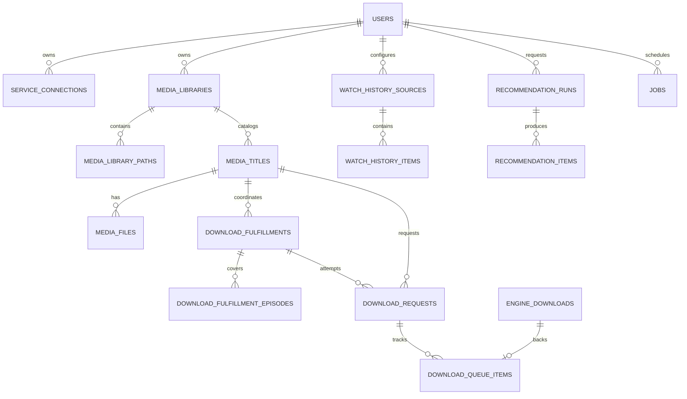
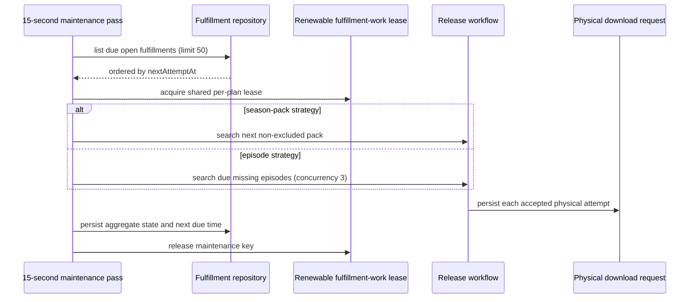

# Data and Background Jobs

> Applies to the current `main` implementation. Last source review: 2026-07-16.

Nooklet uses one SQLite database for durable application state and an in-process worker for scheduled workflows. The worker does not rely on an in-memory queue for ownership: schedules, claims, run tokens, heartbeats, and leases are persisted in the `jobs` table.

## Database lifecycle

The [database client](https://github.com/TannerMidd/Nooklet/blob/main/src/lib/database/client.ts) resolves `DATABASE_URL`, creates the parent directory, opens `better-sqlite3`, and applies these pragmas:

| Setting | Value | Operational effect |
| --- | --- | --- |
| `busy_timeout` | 5,000 ms | Wait briefly for a concurrent writer instead of immediately surfacing `SQLITE_BUSY` |
| `journal_mode` | WAL | Allow readers while writes are committed through the write-ahead log |
| `synchronous` | NORMAL | Balance commit durability and filesystem synchronization cost |
| `foreign_keys` | ON | Enforce declared referential constraints |

Drizzle migrations are applied by `ensureDatabaseReady()` when the runtime first opens the database and whenever the bundled migration journal changes. The current migration sequence is stored under [`drizzle/`](https://github.com/TannerMidd/Nooklet/tree/main/drizzle).

The shipped Compose file overrides the container database URL to `file:/app/data/nooklet.db`. Changing `DATABASE_URL` in `.env` therefore does not move the database when using the shipped Compose service.

## Schema domains

The current [schema](https://github.com/TannerMidd/Nooklet/blob/main/src/lib/database/schema.ts) defines 42 SQLite tables. The grouping below is conceptual; foreign keys cross several groups.

| Domain | Tables | Purpose |
| --- | ---: | --- |
| Identity and configuration | 5 | Users, audit events, preferences, service connections, encrypted service secrets |
| Library and indexers | 14 | Libraries, folders, titles, episodes, files, scans, indexers, categories, secrets, searches, protected search results |
| Downloads | 8 | Download clients, durable season/episode fulfillments, physical requests, queue items, import runs/files, built-in engine records |
| Watch history and jobs | 4 | History sources/runs/items and persisted jobs |
| Recommendations | 6 | Runs, items, metrics, timeline events, feedback, hidden state |
| Security and notifications | 5 | Rate limits, request-attempt guards, notification channels/events/delivery audit |

The diagram is intentionally selective. Use the schema and migration history for column-level truth.

## Worker model

The [worker](https://github.com/TannerMidd/Nooklet/blob/main/src/lib/jobs/worker.ts) starts from [Next.js instrumentation](https://github.com/TannerMidd/Nooklet/blob/main/src/instrumentation.ts). It performs a pass immediately, then every 15 seconds.

Five persisted job types are supported:

- `watch-history-sync`
- `recommendation-run`
- `media-library-scan`
- `missing-content-search`
- `metadata-refresh`

Cancellation reconciliation, download imports, legacy SABnzbd reconciliation, and due season-fulfillment recovery are maintenance work run on each worker pass rather than separate `jobs` rows. The built-in engine runner is also kicked from maintenance and drains its own persisted queue.

The maintenance order is deliberate:

1. Start or wake the built-in engine runner.
2. Reconcile due season-plan cancellations.
3. Reconcile up to three due standalone request cancellations concurrently.
4. Import completed built-in downloads.
5. Import completed SABnzbd downloads, then reconcile duplicate and missing SAB queue rows.
6. Resume due season plans after cancellation, import, and failure evidence has been persisted.

Cancellation intent is checkpointed in SQLite before external cleanup. A request or plan lease owns each reconciliation attempt, downloader queue/history IDs and files are removed and verified, and finalization uses the exact checkpoint timestamp as a compare-and-set fence. Failed verification is due again after five minutes rather than consuming every worker tick. Season cancellation enumerates every linked historical attempt; standalone cancellation is bounded and least-recently-attempted first so an unreachable client cannot starve import work.

## Season-plan recovery protocol

`download_fulfillments` is the durable coordinator for a season request; `download_requests` are its physical release attempts. Open plan state includes the active strategy, aggregate status, pack-attempt count and limit, and `nextAttemptAt`. `download_fulfillment_episodes` stores independent child status, attempt count, and due time.

Because plan and child due times live in SQLite, a restart does not erase pending searches. A shared renewable 15-minute lease prevents interactive, import, and maintenance entry points from advancing the same plan concurrently. If a process exits, the lease expires and a later worker pass can reclaim due work. The database uniqueness constraint also permits only one open plan per user, title, and season.

## Claim and lease protocol

Key timing values:

| Mechanism | Current value | Source |
| --- | ---: | --- |
| Worker poll | 15 seconds | [worker](https://github.com/TannerMidd/Nooklet/blob/main/src/lib/jobs/worker.ts) |
| Job heartbeat | 60 seconds | [worker](https://github.com/TannerMidd/Nooklet/blob/main/src/lib/jobs/worker.ts) |
| Claim lease | 5 minutes | [job repository](https://github.com/TannerMidd/Nooklet/blob/main/src/modules/jobs/repositories/job-repository.ts) |
| Season work lease | 15 minutes, renewed during work | [fulfillment work lease](https://github.com/TannerMidd/Nooklet/blob/main/src/modules/downloads/workflows/season-fulfillment-work-lease.ts) |
| Health stale threshold | 60 seconds | [worker readiness](https://github.com/TannerMidd/Nooklet/blob/main/src/lib/jobs/worker-readiness.ts) |

Each job type has its own process-local lane guard, so unrelated job types may run concurrently while only one job of a given type is claimed by this process at a time. The persisted run token prevents a stale claimant from completing a row it no longer owns.

## Health semantics

The public `/api/health` route checks both database readiness and worker recency:

- HTTP 200 with `status: "ok"` means the database is ready and the latest responsive worker pass has no recorded failure.
- HTTP 200 with `status: "degraded"` means the worker is still ticking but a workload failed. This is intentionally considered container-responsive.
- HTTP 503 means the worker is stopped/stale or database readiness failed.

Authenticated operators can inspect capability blockers, the technical worker error, and job outcomes on `/health`. See [Health and Diagnostics](Health-and-Diagnostics) and [HTTP API](HTTP-API).

## Backup and restore implications

- Use `npm run db:backup` or the documented Docker equivalent. The script uses SQLite's online backup API and verifies both source and destination with `quick_check`.
- Copy Docker backups off the host or volume before considering them durable.
- Stop Nooklet before replacing the live database during restore.
- Remove obsolete `-wal` and `-shm` sidecars after retaining a rollback copy of the prior database.
- Treat backups as credentials: they contain account data, password hashes, audit history, and encrypted service secrets.

See [Backup, Restore, and Upgrades](Backup-Restore-and-Upgrades).

## Known constraints

- SQLite supports the intended one-container topology; it is not a shared multi-node database configuration.
- Persisted job leases improve crash recovery, but the engine singleton, active-lane guards, and import locks are still process-local.
- Season-plan schedules and renewable per-plan work leases are persisted; the maintenance-loop mutex itself remains process-local under the supported one-process topology.
- The public health probe reports worker responsiveness, not the success of every optional integration.
- Migrations run at application startup. Back up before upgrading because rollback may require restoring the pre-upgrade database.
- There is no automated restore drill in the current CI workflow.

Related: [Architecture](Architecture) | [Testing and CI](Testing-and-CI) | [Troubleshooting](Troubleshooting)
