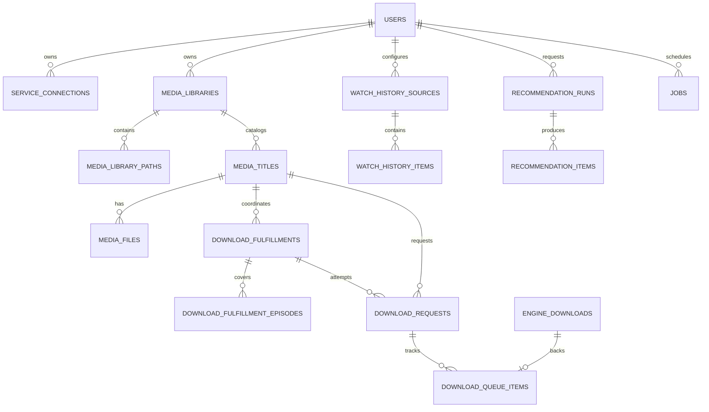
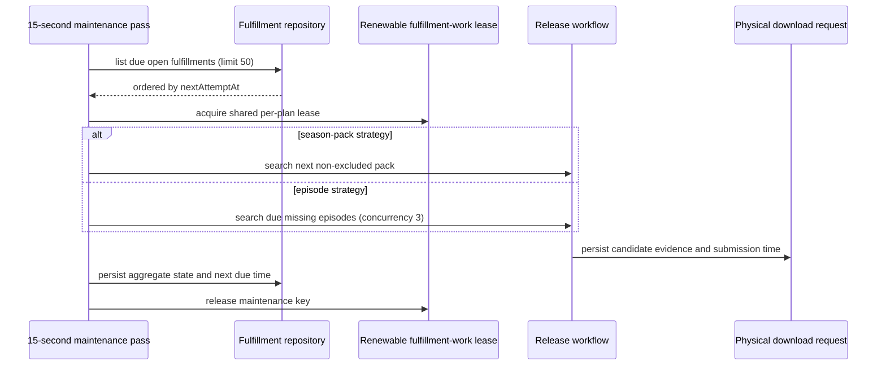
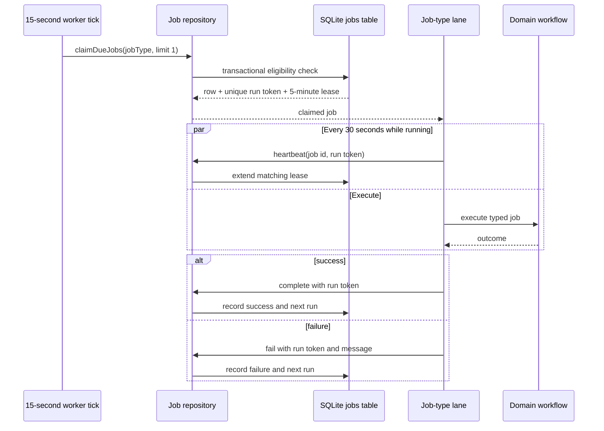

# Data and Background Jobs

> Applies to the current `main` implementation. Last source review: 2026-08-06.

Nooklet uses one SQLite database for durable application state and a separately supervised worker process for scheduled workflows. The worker does not rely on an in-memory queue for ownership: schedules, claims, run tokens, heartbeats, and leases are persisted in the `jobs` table. Production web requests never start the worker or download runner in their own process.

## Database lifecycle

The [database client](https://github.com/TannerMidd/Nooklet/blob/main/src/lib/database/client.ts) resolves `DATABASE_URL`, creates the parent directory, opens `better-sqlite3`, and applies these pragmas:

| Setting        | Value    | Operational effect                                                                  |
| -------------- | -------- | ----------------------------------------------------------------------------------- |
| `busy_timeout` | 5,000 ms | Wait briefly for a concurrent writer instead of immediately surfacing `SQLITE_BUSY` |
| `journal_mode` | WAL      | Allow readers while writes are committed through the write-ahead log                |
| `synchronous`  | NORMAL   | Balance commit durability and filesystem synchronization cost                       |
| `foreign_keys` | ON       | Enforce declared referential constraints                                            |

Drizzle migrations are applied by `ensureDatabaseReady()` when the runtime first opens the database and whenever the bundled migration journal changes. The current migration sequence is stored under [`drizzle/`](https://github.com/TannerMidd/Nooklet/tree/main/drizzle).

The shipped Compose file overrides the container database URL to `file:/app/data/nooklet.db`. Changing `DATABASE_URL` in `.env` therefore does not move the database when using the shipped Compose service.

## Schema domains

The current [schema](https://github.com/TannerMidd/Nooklet/blob/main/src/lib/database/schema.ts) defines the SQLite tables below. The grouping is conceptual; foreign keys cross several groups, and the schema remains the count and column-level authority.

| Domain                     | Purpose                                                                                                                       |
| -------------------------- | ----------------------------------------------------------------------------------------------------------------------------- |
| Identity and configuration | Users, the stable instance-configuration owner, audit events, preferences, service connections, and encrypted service secrets |
| Library and indexers       | Libraries, folders, titles, episodes, files, scans, indexers, categories, secrets, searches, and protected search results     |
| Downloads                  | Durable season/episode fulfillments, physical requests, queue items, import runs/files, and built-in engine records           |
| YouTube                    | User-scoped monitored sources, videos, remote membership, sync state, and durable transfer/import rows                        |
| Watch history and jobs     | History sources/runs/items and persisted jobs                                                                                 |
| Recommendations            | Runs, items, metrics, timeline events, feedback, and hidden state                                                             |
| Security and notifications | Rate limits, request-attempt guards, notification channels/events, and delivery audit                                         |

The diagram is intentionally selective. Use the schema and migration history for column-level truth.

## Worker model

The container, native, and development supervisors start a standalone [worker](https://github.com/TannerMidd/Nooklet/blob/main/src/lib/jobs/worker.ts) beside the Next.js web child. [Next.js instrumentation](https://github.com/TannerMidd/Nooklet/blob/main/src/instrumentation.ts) initializes only the web database client and never starts background work. The worker performs a pass immediately, then every 15 seconds.

Eight persisted job types are supported:

- `watch-history-sync`
- `recommendation-run`
- `media-library-scan`
- `missing-content-search`
- `metadata-refresh`
- `download-import`
- `media-title-delete`
- `youtube-source-sync`

Cancellation reconciliation, built-in download imports, YouTube transfer dispatch, operational-history retention, and due season-fulfillment recovery are maintenance work run by the worker. User-requested scans, import retries, file deletions, and safe stop-then-remove title requests are persisted as immediate jobs so their filesystem work never executes in the web process. A user's **Sync now** or initialization retry for one personal YouTube source is different: the authenticated Server Action performs that network enumeration inline and persists its membership result directly. The administrator's shared **Run now** control creates an immediate persisted `youtube-source-sync` job, while the global recurring schedule is also persisted. A safe title-removal job re-enables its unique immediate job while downloader verification is pending and deletes only the library record after active associations clear. The built-in engine and YouTube runners drain separate persisted queues and may each own one active transfer.

`youtube-source-sync` performs a complete flat enumeration for one user-owned source. Initialization records the baseline without auto-queuing unselected history; later successful complete runs atomically update membership and queue newly discovered eligible videos once. Failed or partial enumeration never marks older membership removed. The shared schedule defaults to six hours and is administrator-configurable from 15 minutes to one week.

Filesystem-backed immediate jobs run serially first (`download-import`, `media-title-delete`, then `media-library-scan`). They do not use lease heartbeats as proof of worker progress, so a wedged mount cannot be hidden by an unrelated network job. Maintenance runs next, in this deliberate order:

1. Prune due operational records once per day.
2. Start or wake the built-in engine runner.
3. Reconcile due season-plan cancellations.
4. Reconcile up to three due standalone request cancellations concurrently.
5. Import completed built-in downloads.
6. Resume due season plans after cancellation, import, and failure evidence has been persisted.

Cancellation intent is checkpointed in SQLite before cleanup. A request or plan lease owns each reconciliation attempt, built-in queue rows and files are removed and verified, and finalization uses the exact checkpoint timestamp as a compare-and-set fence. Failed verification is due again after five minutes rather than consuming every worker tick. Season cancellation enumerates every linked historical attempt; standalone cancellation is bounded and least-recently-attempted first so failed cleanup cannot starve import work.

After an import, Nooklet queues a targeted library scan containing only the affected configured path IDs. The scan workflow revalidates those IDs as active paths owned by the stable instance configuration and fails closed on invalid input. Manual and scheduled scans may still cover every configured path.

## Season-plan recovery protocol

`download_fulfillments` is the durable coordinator for a season request; `download_requests` record selected candidates and use `submittedAt` to prove which ones reached the downloader. Open plan state includes the active strategy, aggregate status, pack-attempt count and limit, and `nextAttemptAt`. `download_fulfillment_episodes` stores independent child status, submitted-attempt count, and due time. Each pass allows eight costly probes and 40 total lightweight inspections; each pack or episode cycle allows three submitted transfers.

Because plan and child due times live in SQLite, a restart does not erase pending searches. A shared renewable 15-minute lease prevents interactive, import, and maintenance entry points from advancing the same plan concurrently. If a process exits, the lease expires and a later worker pass can reclaim due work. The database uniqueness constraint also permits only one open plan per user, title, and season.

## Claim and lease protocol

Key timing values:

| Mechanism                               |                   Current value | Source                                                                                                                                     |
| --------------------------------------- | ------------------------------: | ------------------------------------------------------------------------------------------------------------------------------------------ |
| Worker poll                             |                      15 seconds | [worker](https://github.com/TannerMidd/Nooklet/blob/main/src/lib/jobs/worker.ts)                                                           |
| Job heartbeat                           |                      30 seconds | [worker](https://github.com/TannerMidd/Nooklet/blob/main/src/lib/jobs/worker.ts)                                                           |
| Claim lease                             |                       5 minutes | [job repository](https://github.com/TannerMidd/Nooklet/blob/main/src/modules/jobs/repositories/job-repository.ts)                          |
| Season work lease                       | 15 minutes, renewed during work | [fulfillment work lease](https://github.com/TannerMidd/Nooklet/blob/main/src/modules/downloads/workflows/season-fulfillment-work-lease.ts) |
| Health stale threshold                  |                      60 seconds | [worker readiness](https://github.com/TannerMidd/Nooklet/blob/main/src/lib/jobs/worker-readiness.ts)                                       |
| Storage snapshot refresh / kill ceiling |         60 seconds / 30 seconds | [probe coordinator](https://github.com/TannerMidd/Nooklet/blob/main/scripts/lib/storage-probe-coordinator.mjs)                             |
| Worker heartbeat warning threshold      |          120 seconds by default | [heartbeat watchdog](https://github.com/TannerMidd/Nooklet/blob/main/scripts/lib/worker-heartbeat-watchdog.mjs)                            |

After filesystem work and maintenance finish, unrelated network/AI job types may run concurrently while only one job of a given type is claimed by this process at a time. The persisted run token prevents a stale claimant from completing a row it no longer owns. The overall pass is serialized: a timer tick that arrives while the previous pass is unresolved cannot update success or freshness.

Each claimed background job emits structured start and terminal-result events containing its job ID and type. On `SIGINT` or `SIGTERM`, the worker stops accepting new passes and waits for its active pass to reach a durable boundary. The supervisor retains a ten-second termination ceiling for a genuinely wedged child during this explicit shutdown only. A heartbeat that has not advanced within the configured stale window is logged once and keeps health unhealthy, but does not terminate running work. A worker that actually exits is still restarted with backoff.

## Operational retention

Once per day, the worker removes audit events, notification dispatch audit rows, recommendation timeline events, and non-pending watch-history sync runs older than `OPERATIONAL_RETENTION_DAYS` (default 365; accepted range 30–3650). It does not delete recommendation items or watch-history content. Backup retention remains an operator responsibility.

## Health semantics

The public `/api/health` route executes a real SQLite query and checks the atomically persisted worker heartbeat:

- HTTP 200 with `status: "ok"` means the database is ready, the worker is responsive without a recorded pass failure, and the built-in engine is not degraded.
- HTTP 200 with `status: "degraded"` means the worker is still responsive, but its latest pass failed or the built-in engine reported a stalled/unresolved infrastructure stage. This is intentionally considered container-responsive.
- HTTP 503 means the worker is stopped/stale or database readiness failed.

Authenticated operators can inspect capability blockers, the technical worker error, and job outcomes on `/health`. See [Health and Diagnostics](Health-and-Diagnostics) and [HTTP API](HTTP-API).

## Backup and restore implications

- Use `npm run db:backup` or the documented Docker equivalent. The script uses SQLite's online backup API and verifies both source and destination with `quick_check`.
- Copy Docker backups off the host or volume before considering them durable.
- Stop Nooklet before replacing the live database during restore.
- Remove obsolete `-wal` and `-shm` sidecars after retaining a rollback copy of the prior database.
- Treat backups as credentials: they contain account data, password hashes, audit history, and encrypted service secrets.

See [Backup, Restore, and Upgrades](Backup-Restore-and-Upgrades).

## Known constraints

- SQLite supports the intended one-container topology; it is not a shared multi-node database configuration.
- Persisted job leases improve crash recovery; active-lane guards and import locks remain local to the one supported worker process.
- Season-plan schedules and renewable per-plan work leases are persisted; the maintenance-loop mutex remains worker-local under the supported one-worker topology.
- The web and worker share SQLite on the local Docker named volume. This is not a supported network-filesystem or multi-host database topology.
- An uninterruptible host-mount syscall may require Docker or host repair. The process boundary keeps it from consuming the web process's event loop or libuv pool.
- The public health probe reports worker responsiveness, not the success of every optional integration.
- Migrations run at application startup. Back up before upgrading because rollback may require restoring the pre-upgrade database.
- Migration ordering and artifact presence are validated by `npm run migrations:check`; published migration files are append-only, including the two explicitly documented historical timestamp exceptions.

Related: [Architecture](Architecture) | [Testing and CI](Testing-and-CI) | [Troubleshooting](Troubleshooting)
