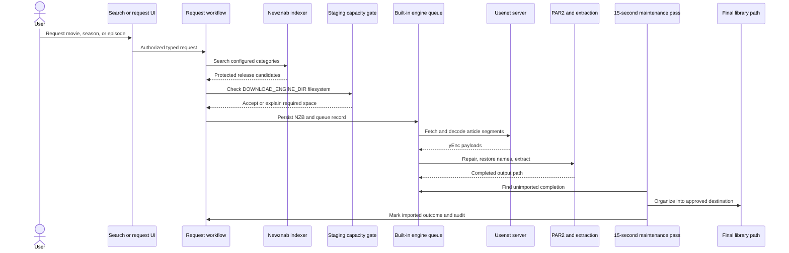
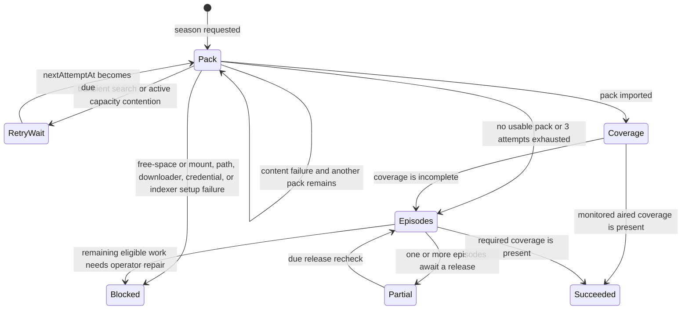
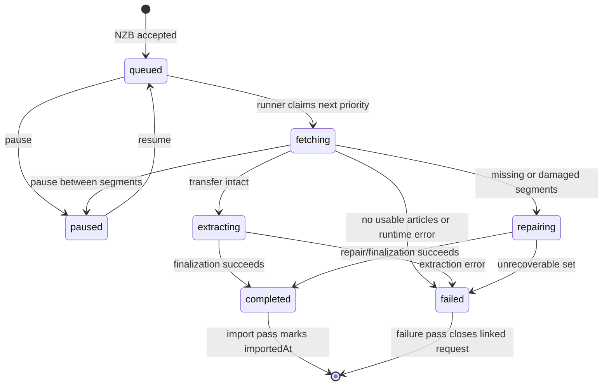

# Downloads and Import

> Applies to the current `main` implementation. Last source review: 2026-07-16.

Nooklet can fetch Usenet releases directly through its built-in downloader or submit them to legacy SABnzbd. Both paths converge on Nooklet-owned request, queue, import, media-file, and audit records.

## End-to-end flow



Primary sources: [request and queue workflows](https://github.com/TannerMidd/Nooklet/tree/main/src/modules/downloads/workflows), [engine runtime](https://github.com/TannerMidd/Nooklet/blob/main/src/modules/download-engine/runtime/engine-runner.ts), and [finalization](https://github.com/TannerMidd/Nooklet/blob/main/src/modules/download-engine/finalize/finalize-download.ts).

## Prerequisites

A complete built-in download path requires:

1. A verified Usenet server connection.
2. A verified Newznab indexer with categories for the requested media type.
3. A reachable and writable `DOWNLOAD_ENGINE_DIR`.
4. A reachable and writable final movie or TV library destination.
5. A responsive background worker.

TMDB is required by the current setup-readiness path for reliable discovery and title identity. AI is optional and is not required to search for or request a known title.

Torznab settings may still exist for compatibility, but automatic acquisition searches exclude them before ranking. If no enabled Newznab source is available, the request stops with a setup action instead of repeatedly retrying or selecting an unqueueable torrent. Torrent transport is not implemented.

## Resilient season fulfillment

Season requests have a coordinator above individual `download_requests`. The coordinator persists the requested season, destination, strategy, attempt budget, next due time, and an aggregate status message. Physical season-pack and episode downloads attach to it as independently inspectable attempts.



Pack release exclusions belong to the fulfillment, so a new season request does not inherit an unrelated historical retry budget. The current automatic pack limit is three physical release attempts. Release/content failures advance the strategy; infrastructure and configuration failures stop fan-out and surface a blocked state.

Capacity has three explicit outcomes:

- If active downloads account for the shortage, the plan waits about five minutes, then retries with exponential backoff without consuming or excluding the release.
- If the release could not fit even on an empty staging filesystem, it is treated as an unusable candidate; Nooklet advances to a smaller pack or episode release.
- If the release fits the filesystem in principle but current non-active free space does not, Nooklet blocks with a workspace/drive-mapping repair action. The release is not consumed, so **Resume season recovery** can use it after the operator fixes storage.

Episode fallback searches only missing, monitored episodes that have aired (an unknown air date is treated as eligible). It skips owned files, attaches to compatible active work, and runs at most three episode searches concurrently. Each episode retains its own attempt count, release exclusions, status, and next due time.

Retry timing is persisted:

| Recovery condition | Current schedule |
| --- | ---: |
| Transient search or unexpected workflow error | Starts at 5 minutes, doubles to a 6-hour cap |
| Capacity reserved by active downloads | Starts at 5 minutes, doubles to a 6-hour cap |
| Active download coverage check | 15 minutes |
| No episode release currently available | 6 hours |

The 15-second worker pass resumes due plans after a process restart. Activity groups all physical attempts into one season plan and shows **Recovering** until the plan succeeds, becomes blocked, or otherwise reaches a terminal state. Notifications are suppressed while the plan is still recovering.

Use **Stop season recovery** in Activity when you no longer want an open plan to keep searching. Nooklet checkpoints the cancellation, removes and verifies any downloader jobs owned by the plan, closes queue-less pending attempts, and keeps media files that were already imported. After cancellation finishes, a zero-file duplicate title can be removed from the Library without leaving its internal attempts behind as standalone Activity items.

Source: [season fulfillment workflow](https://github.com/TannerMidd/Nooklet/blob/main/src/modules/downloads/workflows/season-fulfillment.ts), [fulfillment repository](https://github.com/TannerMidd/Nooklet/blob/main/src/modules/downloads/repositories/season-fulfillment-repository.ts), and [ADR-0003](https://github.com/TannerMidd/Nooklet/blob/main/docs/adr/ADR-0003-durable-season-fulfillment.md).

## Staging capacity policy

The capacity gate measures the filesystem containing `DOWNLOAD_ENGINE_DIR`. Free space on a final TV or movie drive does not substitute for staging space.

For a new NZB, the request-time requirement is:

```text
required bytes = 512 MiB
               + sum(total bytes + remaining bytes for active engine downloads)
               + 2 x declared bytes of the new NZB
```

Current free space already excludes bytes downloaded so far. Each active item therefore reserves its remaining transfer plus a complete output/post-processing copy. The new item receives room for both its assembled archive and an unpacked copy. The 512 MiB term is a fixed safety reserve. This is a conservative admission estimate, not a guarantee that every archive will expand within the estimate.

Use **Settings > Storage** to see the configured path, effective path, underlying filesystem capacity, active reservation, and maximum estimated new download size. See [Storage and Path Mapping](Storage-and-Path-Mapping).

Source: [enqueue capacity check](https://github.com/TannerMidd/Nooklet/blob/main/src/modules/download-engine/workflows/enqueue-nzb-download.ts) and [storage overview](https://github.com/TannerMidd/Nooklet/blob/main/src/modules/storage/queries/get-storage-overview.ts).

## Built-in engine state



The schema also contains an `assembling` enum value for design compatibility, but the current runner does not persist that state. There is no engine-level `importing` state; importing is represented by the outer `download_requests` workflow and the engine row's `importedAt` timestamp.

On process startup, rows stranded in `fetching`, `assembling`, `repairing`, or `extracting` are returned to `queued`. The runner then removes the old incomplete directory and starts the transfer again from the encrypted stored NZB. Per-segment restart resume is not implemented.

## Queue behavior

- The global engine runner claims one queued download at a time across users.
- Priority and creation time determine claim order.
- The active transfer uses up to the configured NNTP connection count, currently limited to 20.
- Pause is observed between segment operations; an active fetch is not terminated in the middle of a filesystem write.
- Resume returns the item to `queued` and starts the runner.
- Remove deletes engine staging/completion data and marks linked request state cancelled/failed.
- Items in repair or extraction cannot be removed until post-processing finishes.
- Queue-wide pause/resume and item reorder operations are source-local.

The browser queue API combines built-in and SABnzbd snapshots for display while preserving `source: "engine" | "sabnzbd"` for correct controls. See [HTTP API](HTTP-API).

## Repair and extraction

The Docker image includes:

| Tool | Use | Missing-tool behavior on a native install |
| --- | --- | --- |
| `par2` | Verify, repair, and restore obfuscated names | Finalization continues with a warning and skips PAR2 verification/repair |
| `unrar` | Inspect and extract RAR sets | RAR extraction fails |
| `7zz` | Inspect and extract ZIP/7z sets | ZIP/7z extraction fails |

Extraction validates archive entry paths, rejects traversal and unsafe links, and keeps output within the engine workspace. Operators running Nooklet directly on a host must provide these exact executable names on `PATH`.

## Import behavior

The worker checks for completed built-in downloads on each 15-second maintenance pass. The import workflow:

1. Resolves the linked request and selected destination.
2. Confirms the source is an engine completion and the destination is an approved media path.
3. Inspects regular media files and rejects unsafe paths.
4. Organizes files without unsafe traversal or silent overwrite.
5. Persists media-file and import records.
6. Triggers library state refresh and notification/audit behavior.
7. Marks the engine row imported and clears retained NZB/password material.

Built-in imports run before legacy SABnzbd reconciliation, so a SAB failure cannot prevent a completed engine item from being imported.

## Legacy SABnzbd path

SABnzbd remains an optional downloader. Nooklet submits a server-resolved NZB, polls queue/history, maps SAB-reported completion paths when needed, imports matching files, removes duplicates, and retries genuinely missing queue entries.

Use `SABNZBD_PATH_MAPPINGS` only when the path SAB reports cannot be resolved by the Nooklet process. In Docker, both sides of the mapping are container-visible paths. `APPROVED_DOWNLOAD_ROOTS` is the fallback boundary for SAB files when mappings are not used.

| Capability | Built-in engine | SABnzbd |
| --- | --- | --- |
| Queue source of truth | Nooklet SQLite | SAB API snapshot/history |
| Transfer transport | Direct NNTP, always TLS | SAB-managed |
| Repair/extraction | Nooklet container tools | SAB-managed |
| Completion import | Nooklet worker | Nooklet worker |
| Missing/duplicate reconciliation | Not required | Required |
| Path translation | Engine workspace is known | Sometimes requires `SABNZBD_PATH_MAPPINGS` |

## Failure and recovery guide

| Symptom | Likely boundary | Recovery |
| --- | --- | --- |
| "Not enough disk space" despite free media drives | Staging filesystem | Inspect `DOWNLOAD_ENGINE_DIR` in Settings > Storage; move it to a spacious bind mount and recreate the container |
| Download restarts after app restart | Current engine recovery semantics | Expected: per-segment resume is not implemented |
| RAR/7z extraction fails on native install | Missing executable | Install `unrar` or `7zz` with the exact command name on `PATH` |
| Import cannot reach destination | Bind mount, approved root, or permissions | Verify the container path, `APPROVED_MEDIA_ROOTS`, and write access |
| SAB completion is never found | Reported path differs from Nooklet-visible path | Configure and verify `SABNZBD_PATH_MAPPINGS` |
| Queue control returns conflict | Item entered post-processing or changed state | Refresh the queue and wait for repair/extraction to complete |
| Failed season release remains visible | Attempt history inside a recovering plan | Check the plan message in Activity; no manual retry is needed while its status is **Recovering** |
| No season pack was found | Release availability | Expected fallback: Activity should show the individual-episode strategy and each unavailable episode will be searched again later |
| Season plan is blocked | Infrastructure or configuration | Follow the plan message, repair storage/path/downloader/credentials, then use **Resume season recovery** |
| Most episodes queued but one is unavailable | Per-episode release availability | Leave the plan open; Nooklet preserves completed work and rechecks the unavailable episode after its cooldown |
| No compatible automatic indexer | Only Torznab or no enabled Newznab source | Configure and verify a Newznab indexer |

## Current limitations

- One Usenet service connection is resolved; primary/block-account failover is not implemented.
- The engine processes one download at a time, although segment fetching within it is concurrent.
- Per-segment restart resume is not implemented.
- Torrent downloads are not implemented.
- The staging formula uses NZB-declared size and a two-copy estimate; unusually expansive archives may need more room.
- Post-processing is not safely cancellable once repair or extraction begins.

Related: [Storage and Path Mapping](Storage-and-Path-Mapping) | [Health and Diagnostics](Health-and-Diagnostics) | [Troubleshooting](Troubleshooting)
