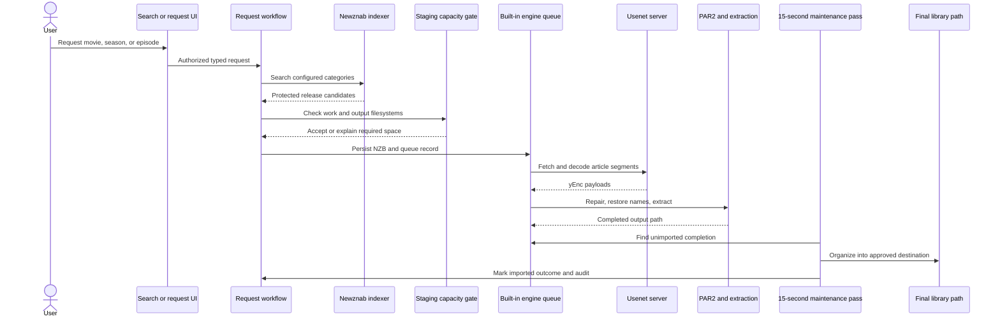
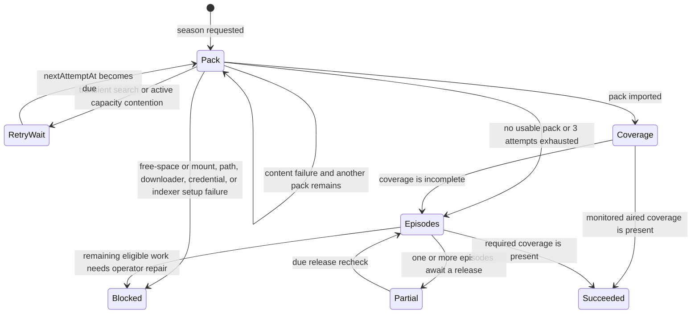
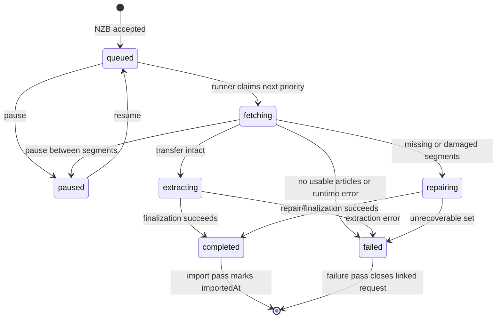

# Downloads and Import

> Applies to the current `main` implementation. Last source review: 2026-08-07.

Nooklet fetches movie and TV releases through its built-in Usenet downloader and public videos through its dedicated YouTube runner. Nooklet owns each request, queue, transfer, import, and audit record end to end; Usenet repair and archive extraction remain specific to movie/TV releases.

## End-to-end flow



Primary sources: [request and queue workflows](https://github.com/TannerMidd/Nooklet/tree/main/src/modules/downloads/workflows), [engine runtime](https://github.com/TannerMidd/Nooklet/blob/main/src/modules/download-engine/runtime/engine-runner.ts), and [finalization](https://github.com/TannerMidd/Nooklet/blob/main/src/modules/download-engine/finalize/finalize-download.ts).

## Prerequisites

A complete built-in download path requires:

1. A verified Usenet server connection.
2. A verified Newznab indexer with categories for the requested media type.
3. Reachable and writable `DOWNLOAD_ENGINE_WORK_DIR` and `DOWNLOAD_ENGINE_DIR` locations.
4. A reachable, readable, and writable final movie or TV library destination.
5. A responsive background worker.

TMDB is required by the current setup-readiness path for reliable discovery and title identity. AI is optional and is not required to search for or request a known title.

Torznab settings may still exist for compatibility, but automatic acquisition searches exclude them before ranking. If no enabled Newznab source is available, the request stops with a setup action instead of repeatedly retrying or selecting an unqueueable torrent. Torrent transport is not implemented.

## YouTube transfer lane

YouTube downloads are durable rows owned by the requesting user and identified by the video, destination, and quality profile. They appear in the same **Activity** experience with progress, cancellation, retry, failure, and completed-import state, but they do not change the existing authenticated Usenet queue API. YouTube activity is queried and paginated independently so a long archive does not make every Activity page unbounded.

The worker runs one YouTube transfer at a time. It can coexist with the one-at-a-time Usenet engine; both active transfers contribute to capacity decisions. YouTube work stages beneath `YOUTUBE_WORK_DIR/incomplete/<download-id>`, resumes valid `.part` files after a restart, and publishes only after a final cancellation and destination-containment check.

Imports use the selected YouTube root and organize the first completed profile as `<channel>/<playlist>/<date> - <title> [<video-id>].<ext>`. Channel-feed and individual-video downloads use `Videos` in place of the playlist name. If another profile for that video and root produces different bytes, its import receives a deterministic `[quality-profile]` suffix so neither artifact is silently reused or overwritten. MP4 profiles prefer mergeable streams at or below their height ceiling without CPU-heavy transcoding; `best` uses the best mergeable formats offered by the extractor. Remote playlist changes and monitor deletion never remove a completed file. Plex **Other Videos** libraries require the **Folders** view to display this directory hierarchy; their default grid remains flat.

Transient network and rate-limit failures retry on a bounded 15-minute, 1-hour, 6-hour, and 24-hour schedule. Private, removed, live, or positively identified Short content is terminal without repeated retries. See [YouTube monitoring and downloads](YouTube-Monitoring-and-Downloads) for the full scope and workflow.

## Resilient season fulfillment

Season requests have a coordinator above individual `download_requests`. The coordinator persists the requested season, destination, strategy, attempt budget, next due time, and an aggregate status message. Physical season-pack and episode downloads attach to it as independently inspectable attempts.



Pack release exclusions belong to the fulfillment, so a new season request does not inherit an unrelated historical retry budget. A search pass inspects at most 40 lightweight candidates and performs at most eight costly candidate probes. Pack and episode cycles each allow three releases that actually reach the downloader. A preflight rejection stays excluded but does not spend a submitted attempt; a zero-byte content failure is refunded. Release/content failures advance the strategy; infrastructure and configuration failures stop fan-out and surface a blocked state.

Capacity has three explicit outcomes:

- If active downloads account for the shortage, the plan waits about five minutes, then retries with exponential backoff without consuming or excluding the release.
- If the release could not fit even on an empty staging filesystem, it is treated as an unusable candidate; Nooklet advances to a smaller pack or episode release.
- If the release fits the filesystem in principle but current non-active free space does not, Nooklet blocks with a workspace/drive-mapping repair action. The release is not consumed, so **Resume season recovery** can use it after the operator fixes storage.

Episode fallback searches only missing, monitored episodes that have aired (an unknown air date is treated as eligible). It skips owned files, attaches to compatible active work, and runs at most three episode searches concurrently. Each episode retains its own submitted-attempt count, release exclusions, status, and next due time. Eight rejected probes or exhaustion of the current candidate set schedules the six-hour release cooldown without spending a submitted attempt; a search with no results begins the five-minute exponential schedule.

When every selected indexer fails, the pass is treated as infrastructure failure. A 429, timeout, or 5xx stops new episode fan-out after the current batch of at most three settles and retries with backoff. Missing indexers, credentials, and other terminal setup errors block the untouched children and expose **Resume season recovery**. If at least one indexer succeeds, its results proceed despite failures from other sources.

For an aired, monitored episode in an open individual-episode plan, **Search** in Library performs an immediate targeted retry inside that plan. It resets only that episode's three-submission cycle and retains the plan destination and exclusions. A busy, cancelling, or season-pack plan reports why it cannot start and never creates a duplicate independent request. Future, unmonitored, and no-plan episodes keep the independent manual override.

Retry timing is persisted:

| Recovery condition                            |                             Current schedule |
| --------------------------------------------- | -------------------------------------------: |
| Transient search or unexpected workflow error | Starts at 5 minutes, doubles to a 6-hour cap |
| Capacity reserved by active downloads         | Starts at 5 minutes, doubles to a 6-hour cap |
| Active download coverage check                |                                   15 minutes |
| No episode release currently available        |                                      6 hours |

The 15-second worker pass resumes due plans after a process restart. Activity groups all physical attempts into one season plan and shows **Recovering** until the plan succeeds, becomes blocked, or otherwise reaches a terminal state. Its expandable unresolved-episode list shows each episode code, title, state, submitted-attempt count, exact reason, and next attempt. Notifications are suppressed while the plan is still recovering.

Use **Stop season recovery** in Activity when you no longer want an open plan to keep searching. Nooklet checkpoints the cancellation, removes and verifies any downloader jobs owned by the plan, closes queue-less pending attempts, and keeps media files that were already imported. For a zero-file duplicate, Library removal also offers an explicit **Stop active season plans and downloads first** option. That persists one safe-removal job, waits for the same verified cleanup, and removes only the library record; imported media files remain on disk.

Source: [season fulfillment workflow](https://github.com/TannerMidd/Nooklet/blob/main/src/modules/downloads/workflows/season-fulfillment.ts), [fulfillment repository](https://github.com/TannerMidd/Nooklet/blob/main/src/modules/downloads/repositories/season-fulfillment-repository.ts), and [ADR-0003](https://github.com/TannerMidd/Nooklet/blob/main/docs/adr/ADR-0003-durable-season-fulfillment.md).

## Staging capacity policy

The capacity gate measures both the in-flight filesystem containing `DOWNLOAD_ENGINE_WORK_DIR` and the completed-output filesystem containing `DOWNLOAD_ENGINE_DIR`. The lower usable capacity constrains admission. Free space on a final TV or movie drive does not substitute for either engine location.

For a new NZB, the request-time requirement is:

```text
required bytes = 512 MiB
               + sum(total bytes + remaining bytes for active engine downloads)
               + 2 x declared bytes of the new NZB
```

Current free space already excludes bytes downloaded so far. Each active item therefore reserves its remaining transfer plus a complete output/post-processing copy. The new item receives room for both its assembled archive and an unpacked copy. The 512 MiB term is a fixed safety reserve. This is a conservative admission estimate, not a guarantee that every archive will expand within the estimate.

Use **Settings > Storage** to see both configured and effective paths, their underlying filesystem capacities, active reservation, and the maximum estimated new download size. See [Storage and Path Mapping](Storage-and-Path-Mapping).

Source: [enqueue capacity check](https://github.com/TannerMidd/Nooklet/blob/main/src/modules/download-engine/workflows/enqueue-nzb-download.ts) and [storage overview](https://github.com/TannerMidd/Nooklet/blob/main/src/modules/storage/queries/get-storage-overview.ts).

## Built-in engine state



Assembly happens in place during `fetching`; there is no separate persisted `assembling` state. There is also no engine-level `importing` state: importing is represented by the outer `download_requests` workflow and the engine row's `importedAt` timestamp.

On process startup, rows stranded in `fetching`, `repairing`, or `extracting` are returned to `queued`. The runner then removes the old incomplete directory and starts the transfer again from the encrypted stored NZB. Per-segment restart resume is not implemented.

## Queue behavior

- The global engine runner claims one queued download at a time across users.
- Priority and creation time determine claim order.
- The active transfer uses up to the configured NNTP connection count, currently limited to 20.
- Pause is observed between segment operations; an active fetch is not terminated in the middle of a filesystem write.
- Resume returns the item to `queued` and starts the runner.
- Remove persists cancellation, deletes engine staging/completion data in the isolated worker, and terminalizes linked request state after cleanup is verified.
- Cancellation requested during repair or extraction waits for the current post-processing operation to return, then removes any finalized output instead of publishing it.
- Queue-wide pause/resume and item reorder operations apply to the built-in queue.

The authenticated browser API at `/api/downloads/queue` returns only the caller's associated built-in queue items and accepts actions without a downloader-source discriminator. See [HTTP API](HTTP-API).

## Repair and extraction

The Docker image includes:

| Tool    | Use                                          | Missing-tool behavior on a native install                                                                                     |
| ------- | -------------------------------------------- | ----------------------------------------------------------------------------------------------------------------------------- |
| `par2`  | Verify, repair, and restore obfuscated names | An intact, plainly named payload may continue with a warning; damaged or obfuscated content that depends on PAR2 fails safely |
| `unrar` | Inspect and extract RAR sets                 | RAR extraction fails                                                                                                          |
| `7zz`   | Inspect and extract ZIP/7z sets              | ZIP/7z extraction fails                                                                                                       |

Extraction validates archive entry paths, rejects traversal and unsafe links, and keeps output within the engine workspace. Operators running Nooklet directly on a host must provide these exact executable names on `PATH`.

## Import behavior

The worker checks for completed built-in downloads on each 15-second maintenance pass. The import workflow:

1. Resolves the linked request and selected destination.
2. Confirms the source is an engine completion and the destination is an approved media path.
3. Inspects regular media files and rejects unsafe paths.
4. Organizes files without unsafe traversal or silent overwrite.
5. Persists media-file and import records.
6. Queues a library scan limited to the affected active destination path IDs, then triggers notification/audit behavior.
7. Marks the engine row imported and clears retained NZB/password material.

The import source must resolve inside the finalized directory recorded for the engine item. There is no external completed-path mapping setting: `DOWNLOAD_ENGINE_DIR` is the only finalized staging root.

## Failure and recovery guide

| Symptom                                           | Likely boundary                                                    | Recovery                                                                                                                                            |
| ------------------------------------------------- | ------------------------------------------------------------------ | --------------------------------------------------------------------------------------------------------------------------------------------------- |
| "Not enough disk space" despite free media drives | Engine work or completed-output filesystem                         | Inspect both engine locations in Settings > Storage; move the constrained location to suitable storage and recreate the container                   |
| Download restarts after app restart               | Current engine recovery semantics                                  | Expected: per-segment resume is not implemented                                                                                                     |
| RAR/7z extraction fails on native install         | Missing executable                                                 | Install `unrar` or `7zz` with the exact command name on `PATH`                                                                                      |
| Import cannot reach destination                   | Bind mount, approved root, or permissions                          | Verify the container path, `APPROVED_MEDIA_ROOTS`, and write access                                                                                 |
| Completed engine output is not imported           | Worker, finalized staging path, or destination path is unavailable | Inspect Activity, `/health`, both engine paths, and destination permissions; retry the import after the path is healthy                             |
| Queue control returns conflict                    | Item entered post-processing or changed state                      | Refresh the queue and wait for repair/extraction to complete                                                                                        |
| Failed season release remains visible             | Attempt history inside a recovering plan                           | Check the plan and episode details in Activity; recovery continues automatically, and Library **Search** can retry one eligible episode immediately |
| No season pack was found                          | Release availability                                               | Expected fallback: Activity should show the individual-episode strategy and each unavailable episode will be searched again later                   |
| Season plan is blocked                            | Infrastructure or configuration                                    | Follow the plan message, repair storage/path/downloader/credentials, then use **Resume season recovery**                                            |
| Most episodes queued but one is unavailable       | Per-episode release availability                                   | Leave the plan open; Nooklet preserves completed work and rechecks the unavailable episode after its cooldown                                       |
| No compatible automatic indexer                   | Only Torznab or no enabled Newznab source                          | Configure and verify a Newznab indexer                                                                                                              |

## Current limitations

- One Usenet service connection is resolved; primary/block-account failover is not implemented.
- The engine processes one download at a time, although segment fetching within it is concurrent.
- Per-segment restart resume is not implemented.
- Torrent downloads are not implemented.
- The staging formula uses NZB-declared size and a two-copy estimate; unusually expansive archives may need more room.
- Post-processing cannot be interrupted mid-tool invocation; cancellation is durable and cleanup runs as soon as that invocation returns.

Related: [Storage and Path Mapping](Storage-and-Path-Mapping) | [Health and Diagnostics](Health-and-Diagnostics) | [Troubleshooting](Troubleshooting)
