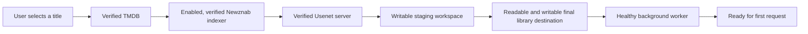

# Getting started

Nooklet is a self-hosted application for discovering, requesting, downloading, and organizing movies and TV. This page is the map from an empty machine to a verified first request. Follow the linked guides in order; optional integrations can wait.

## Recommended path

| Path                                       | Use it when                                                                                                      |
| ------------------------------------------ | ---------------------------------------------------------------------------------------------------------------- |
| [Docker installation](Docker-Installation) | **Recommended for almost everyone.** Docker supplies and supervises the complete supported runtime.              |
| [Native installation](Native-Installation) | Advanced/development only. You will manage Node.js, every native media tool, filesystem access, and supervision. |

For the fewest manual steps, open the [Docker setup builder](https://tannermidd.github.io/Nooklet/guide/#docker-configurator). It generates one private command for a new installation, verifies the selected folders, starts Nooklet, and waits for application health. Use the full [Docker installation](Docker-Installation) page when you prefer to enter every value yourself.

## What is required

You do not need to connect every service. The smallest complete request path is:



| Capability                 | Required? | Configuration                                                                                              |
| -------------------------- | --------- | ---------------------------------------------------------------------------------------------------------- |
| Browse and identify titles | Yes       | A verified TMDB connection                                                                                 |
| Search releases            | Yes       | At least one enabled and verified Newznab indexer with movie or TV categories                              |
| Download                   | Yes       | A verified Usenet server for the built-in engine                                                           |
| Import                     | Yes       | A reachable, readable, and writable movie or TV library destination                                        |
| Process background work    | Yes       | A responsive, non-degraded worker                                                                          |
| Download work and staging  | Yes       | Reachable and writable `DOWNLOAD_ENGINE_WORK_DIR` and `DOWNLOAD_ENGINE_DIR` locations with usable capacity |
| AI recommendations         | No        | An OpenAI-compatible AI provider                                                                           |
| Watch history              | No        | Plex, Tautulli, Trakt, or manual imports                                                                   |
| Notifications              | No        | Discord, Apprise, or a generic webhook                                                                     |

## Credentials and folders to gather

You can install and open Nooklet with Docker, Git, one media folder, one separate completed-download staging folder, and enough Docker data-storage capacity. Before the first movie or TV request, also gather:

- **TMDB credential** — identifies titles and supplies metadata and artwork.
- **Newznab API key** — searches an indexer for releases.
- **Usenet credentials** — let the built-in downloader retrieve a selected release.
- **Movie and/or TV library folder** — the final destination for imported files.
- **Completed-download folder** — a separate host location for output waiting to be imported.
- **Docker data storage** — enough capacity for the named volume that holds in-flight downloads, repair, and extraction work.

The guided Docker setup generates `AUTH_SECRET`, `BOOTSTRAP_TOKEN`, and `SECRET_BOX_KEY` for you. A manual install requires three independently generated values.

The bind-mounted completed-output folder can live on the same physical disk as the media library, but it is a separate runtime path. Docker's `/app/data` volume is a second capacity location for in-flight and extraction work. See [Storage and path mapping](Storage-and-Path-Mapping) before starting the container.

## Installation sequence

1. Complete [Docker installation](Docker-Installation), including the `/api/health` check. Use [Native installation](Native-Installation) only when you intentionally chose the advanced path.
2. Open Nooklet and create the first administrator with the printed one-time bootstrap token. Nooklet automatically closes `/bootstrap` as soon as an administrator exists and refuses later bootstrap attempts.
3. After sign-in, continue in **Setup Center** and follow [First-time setup](First-Time-Setup) in order: TMDB, Usenet, Newznab, final storage, and worker health.
4. Confirm at least one of **Movie downloads** or **TV downloads** is marked **Ready** in **Setup Center**.
5. Search for a small, unambiguous title and submit a controlled first request.

The detailed guided sequence is in [First-time setup](First-Time-Setup).

## How configuration is shared

Instance services, indexers, storage, and download infrastructure serve every user, and non-administrators cannot edit them. Nooklet persists a stable instance-configuration owner so every administrator reads and edits the same shared rows; demoting or disabling the backing account does not switch the effective configuration. Trakt is personal to the user who connects it; personal history and notification preferences remain user-scoped where the interface indicates.

## Know when the instance is healthy

The container and external monitors use `GET /api/health`. A healthy response confirms the database is reachable and the background worker is responsive. Setup Center performs the broader product-readiness evaluation, including verified services, indexers, and writable storage.

**Linux or macOS**

```console
curl --fail-with-body http://127.0.0.1:42021/api/health
```

**Windows PowerShell**

```powershell
Invoke-RestMethod http://127.0.0.1:42021/api/health | ConvertTo-Json -Depth 5
```

Continue when the response is HTTP `200` with top-level `"status": "ok"` and `checks.database` and `checks.backgroundWorker` both set to `"ok"`. HTTP `503` means the database or worker is unavailable. HTTP `200` with `"status": "degraded"` means the app is responsive but needs attention; use **Health & readiness** and [Health and diagnostics](Health-and-Diagnostics) before making the first request.

## Next steps

- [Docker installation](Docker-Installation)
- [Native installation](Native-Installation)
- [First-time setup](First-Time-Setup)
- [Configuration reference](Configuration-Reference)
- [Storage and path mapping](Storage-and-Path-Mapping)
- [Service connections](Service-Connections)
- [Indexers](Indexers)
- [Troubleshooting](Troubleshooting)

## Implementation references

- [Compose service definition](https://github.com/TannerMidd/Nooklet/blob/main/docker-compose.yml)
- [Runtime image](https://github.com/TannerMidd/Nooklet/blob/main/Dockerfile)
- [Readiness evaluation](https://github.com/TannerMidd/Nooklet/blob/main/src/modules/readiness/evaluate-readiness.ts)
- [Health route](https://github.com/TannerMidd/Nooklet/blob/main/src/app/api/health/route.ts)
