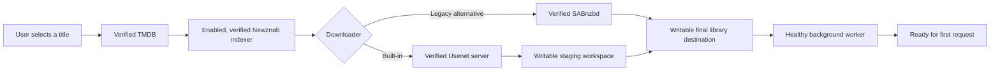

# Getting started

Nooklet is a self-hosted application for discovering, requesting, downloading, and organizing movies and TV. This guide gets a new instance from an empty machine to a verified first request without requiring every optional integration.

## Choose an installation path

| Path | Best for | You provide |
| --- | --- | --- |
| [Docker installation](Docker-Installation) | Most home servers, NAS hosts, and always-on deployments | Docker Compose, media folders, and service credentials |
| [Native installation](Native-Installation) | Development and operators who manage Node.js processes directly | Node.js 24, native archive tools, process supervision, and filesystem permissions |

Docker Compose is the recommended path. The image already contains Node.js, SQLite support, PAR2, UnRAR, 7-Zip, the background worker, and the built-in downloader.

## What is required

You do not need to connect every service. The smallest complete request path is:



| Capability | Required? | Configuration |
| --- | --- | --- |
| Browse and identify titles | Yes | A verified TMDB connection |
| Search releases | Yes | At least one enabled and verified Newznab indexer with movie or TV categories |
| Download | Yes | A verified Usenet server for the built-in engine, or verified SABnzbd |
| Import | Yes | A reachable and writable movie or TV library destination |
| Process background work | Yes | A responsive, non-degraded worker |
| Download staging | Built-in engine only | A reachable and writable `DOWNLOAD_ENGINE_DIR` with usable capacity |
| AI recommendations | No | An OpenAI-compatible AI provider |
| Watch history | No | Plex, Tautulli, Trakt, or manual imports |
| Notifications | No | Discord, Apprise, or a generic webhook |

## Before you begin

Gather the following:

- A host folder for movie media and/or TV media.
- A separate download staging folder if you will use the built-in downloader.
- A TMDB API credential.
- A Newznab indexer account and API key.
- Usenet server credentials, or an existing SABnzbd instance.
- Three independently generated secrets for `AUTH_SECRET`, `BOOTSTRAP_TOKEN`, and `SECRET_BOX_KEY`.

The staging folder can live on the same physical disk as the media library, but it is a separate runtime path and a separate capacity check. See [Storage and path mapping](Storage-and-Path-Mapping) before starting the container.

## Installation sequence

1. Follow [Docker installation](Docker-Installation) or [Native installation](Native-Installation).
2. Open the application and create the first administrator with the one-time bootstrap token.
3. Use **Setup Center** to configure TMDB, a downloader, an indexer, and storage.
4. Confirm at least one of **Movie downloads** or **TV downloads** is marked **Ready**.
5. Search for a title and submit a small first request.
6. Remove `BOOTSTRAP_TOKEN` from the environment after the administrator exists.

The detailed guided sequence is in [First-time setup](First-Time-Setup).

## How configuration is shared

Instance services, indexers, storage, and download infrastructure are administered centrally and serve every user. A non-administrator can use those shared capabilities but cannot change them. Trakt is personal to the user who connects it; personal history and notification preferences remain user-scoped where the interface indicates.

## Know when the instance is healthy

The container and external monitors use `GET /api/health`. A healthy response confirms the database is reachable and the background worker is responsive. Setup Center performs the broader product-readiness evaluation, including verified services, indexers, and writable storage.

```bash
curl http://localhost:42021/api/health
```

The health route returns HTTP `503` when the database is unavailable or the worker is not responsive. A responsive worker whose recent maintenance pass reported an error can return HTTP `200` with a degraded status in the response body; use **Health & readiness** in the app for details.

## Next steps

- [Docker installation](Docker-Installation)
- [Native installation](Native-Installation)
- [First-time setup](First-Time-Setup)
- [Configuration reference](Configuration-Reference)
- [Storage and path mapping](Storage-and-Path-Mapping)
- [Service connections](Service-Connections)
- [Indexers](Indexers)
- [Troubleshooting](Troubleshooting)

## Implementation references

- [Compose service definition](https://github.com/TannerMidd/Nooklet/blob/main/docker-compose.yml)
- [Runtime image](https://github.com/TannerMidd/Nooklet/blob/main/Dockerfile)
- [Readiness evaluation](https://github.com/TannerMidd/Nooklet/blob/main/src/modules/readiness/evaluate-readiness.ts)
- [Health route](https://github.com/TannerMidd/Nooklet/blob/main/src/app/api/health/route.ts)
