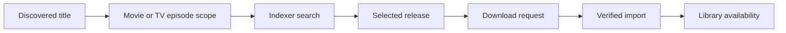

# Library and requests

Nooklet treats a library destination, a media title, and a download request as distinct records. That separation lets the UI show what is known, what was requested, what is downloading, and what was actually imported.

## Before requesting

For each media type you plan to request:

1. Bind-mount the host library into Docker.
2. Approve its container parent with `APPROVED_MEDIA_ROOTS`.
3. Add the movie or TV destination in **Settings** using the container-side path.
4. Verify that the destination is reachable and writable.
5. Scan the destination and confirm existing titles appear in **Library**.

Read-only access is enough for browsing an existing tree, but imports require write access. See [Storage and path mapping](Storage-and-Path-Mapping).

## Request flow

Movies are requested as a title. TV requests can carry season and episode scope. The selected destination determines where successful imports are organized.

Nooklet prevents conflicting active work for the same scoped content and keeps request state visible while the downloader and import worker progress. A title is not considered available merely because an NZB was queued; the import must complete and the library must observe the resulting file.

## Monitoring and rescans

Library scans reconcile the configured filesystem with stored media state. Automated scans are persisted jobs, and administrators can inspect or run job types from the automation/health experience. If external software moves files, run a scan after the move and verify the destination path still resolves inside Nooklet.

## Verification checklist

- The destination appears healthy in **Settings → Storage**.
- Existing media is visible after a scan.
- Setup Center shows the intended movie or TV path as ready.
- A test request moves beyond search into the download queue.
- The completed file lands under the selected destination and becomes available in the library.

## Common failures

| Symptom | Correct next check |
| --- | --- |
| Destination cannot be selected | Attach and verify a destination for that media type. |
| Path is outside approved roots | Use a container path under `APPROVED_MEDIA_ROOTS`. |
| Scan works but import fails | The directory may be readable but not writable by the container user. |
| TV request selects the wrong scope | Review season and episode selection before choosing a release. |
| Completed download remains in progress | Inspect the import worker, path mapping, archive tools, and destination permissions. |

## Source references

- [Media library module](https://github.com/TannerMidd/Nooklet/tree/main/src/modules/media-library)
- [Downloads module](https://github.com/TannerMidd/Nooklet/tree/main/src/modules/downloads)
- [Filesystem policy](https://github.com/TannerMidd/Nooklet/blob/main/src/lib/security/filesystem-policy.ts)
- [Product behavior matrix](https://github.com/TannerMidd/Nooklet/blob/main/docs/product/behavior-matrix.md)

---

Last reviewed: **July 15, 2026**.
