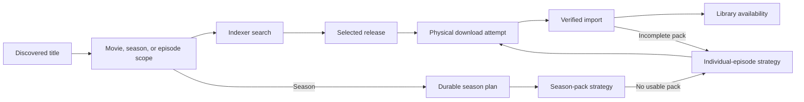

# Library and requests

Nooklet treats a library destination, a media title, and a download request as distinct records. That separation lets the UI show what is known, what was requested, what is downloading, and what was actually imported.

## Before requesting

For each media type you plan to request:

1. Bind-mount the host library into Docker.
2. Approve its container parent with `APPROVED_MEDIA_ROOTS`.
3. Add the movie or TV destination in **Settings** using the container-side path.
4. Verify that the destination is reachable, readable, and writable.
5. Scan the destination and confirm existing titles appear in **Library**.

Read-only access is enough for browsing an existing tree, but imports require write access. See [Storage and path mapping](Storage-and-Path-Mapping).

## Request flow

Movies are requested as a title. TV requests can carry season and episode scope. The selected destination determines where successful imports are organized.

Nooklet prevents conflicting active work for the same scoped content and keeps request state visible while the downloader and import worker progress. A title is not considered available merely because an NZB was queued; the import must complete and the library must observe the resulting file.

## What happens when you request a season

A season request creates one durable plan in **Activity**. A release download is an attempt inside that plan, not the plan itself.

1. Nooklet searches for a matching complete-season pack first.
2. Nooklet may probe up to eight candidates in a pass. Preflight rejects are excluded without spending one of the three pack submissions; only releases that reach the downloader count.
3. If no usable pack exists or pack attempts are exhausted, Nooklet switches to individual episodes without requiring another request.
4. A pack that imports successfully is checked against current episode coverage. Missing monitored, aired episodes are still queued individually.
5. Episodes already in the library or already downloading are reused. Future or unmonitored episodes are deferred.
6. Missing episodes keep independent release history and retry schedules, so one unavailable episode does not discard progress on the rest of the season.

Activity groups the attempts under the season plan and labels it **Recovering** while automatic work remains. A failed child attempt does not mean the season request has failed. Expand the episode list for exact reasons and retry times. Automatic recovery continues, and **Search** on an eligible Library episode can immediately retry only that episode inside the plan.

To abandon an open plan, choose **Stop season recovery** in Activity. This stops future searches and safely removes the plan's active downloader work while retaining files that have already reached the library. When removing an empty duplicate title, you can instead explicitly select **Stop active season plans and downloads first** in the removal dialog. Nooklet keeps that removal intent queued until cleanup is verified, then removes the title record without deleting imported media files.

Nooklet does not fan a configuration failure out into many episode requests. Capacity held by active downloads waits and retries automatically. A currently full or incorrectly mapped staging filesystem, destination problem, credential failure, missing Newznab source, or downloader failure blocks the plan with a corrective message without consuming the selected release. Fix that condition, then use **Resume season recovery** from Activity.

## Monitoring and rescans

Library scans reconcile the configured filesystem with stored media state. Automated scans are persisted jobs, and administrators can inspect or run job types from the automation/health experience. If external software moves files, run a scan after the move and verify the destination path still resolves inside Nooklet.

## Verification checklist

- The destination appears healthy in **Settings → Storage**.
- Existing media is visible after a scan.
- Setup Center shows the intended movie or TV path as ready.
- A test request moves beyond search into the download queue.
- The completed file lands under the selected destination and becomes available in the library.

## Common failures

| Symptom                                | Correct next check                                                                                                                                              |
| -------------------------------------- | --------------------------------------------------------------------------------------------------------------------------------------------------------------- |
| Destination cannot be selected         | Attach and verify a destination for that media type.                                                                                                            |
| Path is outside approved roots         | Use a container path under `APPROVED_MEDIA_ROOTS`.                                                                                                              |
| Scan works but import fails            | The directory may be readable but not writable by the container user.                                                                                           |
| TV request selects the wrong scope     | Review season and episode selection before choosing a release.                                                                                                  |
| A season pack fails                    | Open **Activity**. A **Recovering** plan continues automatically; after it switches to episodes, Library **Search** can retry one eligible episode immediately. |
| No season pack exists                  | Confirm the plan switched to individual episodes. Episodes without releases remain scheduled for a later search.                                                |
| Season recovery says blocked           | Read the corrective message, fix storage, destination, downloader, or credentials, then use **Resume season recovery**.                                         |
| Completed download remains in progress | Inspect the import worker, engine and destination mounts, archive tools, and destination permissions.                                                           |

## Source references

- [Media library module](https://github.com/TannerMidd/Nooklet/tree/main/src/modules/media-library)
- [Downloads module](https://github.com/TannerMidd/Nooklet/tree/main/src/modules/downloads)
- [Season fulfillment workflow](https://github.com/TannerMidd/Nooklet/blob/main/src/modules/downloads/workflows/season-fulfillment.ts)
- [Filesystem policy](https://github.com/TannerMidd/Nooklet/blob/main/src/lib/security/filesystem-policy.ts)
- [Product behavior matrix](https://github.com/TannerMidd/Nooklet/blob/main/docs/product/behavior-matrix.md)

---

Last reviewed: **August 6, 2026**.
