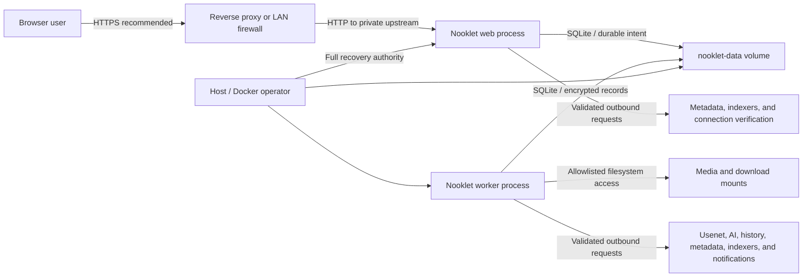

# Security model

Nooklet is a self-hosted application that handles account credentials, integration secrets, outbound service connections, and writable media paths. Its built-in controls reduce risk, but the operator remains responsible for host security, TLS, network exposure, backups, and the services Nooklet is allowed to reach.

## Trust boundaries

The Docker/host operator is a privileged security principal. Host access can read `.env`, replace the application image, mount the data volume, or run the account recovery tool. Application roles do not defend against a compromised host administrator.

## Authentication and sessions

- Nooklet uses local email-and-password credentials.
- Passwords are salted and hashed with scrypt; plaintext passwords are not stored.
- Password policy is 12–128 characters with lowercase, uppercase, and numeric characters.
- Sessions use encrypted JWT cookies plus a per-login SQLite validity record, with an absolute 24-hour maximum age. The record and token carry the user's monotonic `auth_generation`.
- Login issuance transactionally rechecks the generation observed during credential verification. Account disablement and password writes advance the generation and revoke existing records, preventing an already-running login from becoming valid after an invalidation race.
- Nooklet's UI sign-out action deletes the current validity record before clearing the cookie. A late authenticated response may copy the old cookie back into a browser, but that token remains invalid server-side. Direct `POST /api/auth/signout` is intentionally unavailable; use the application's **Sign out** control.
- Live account and generation checks invalidate sessions after account disablement or a password change. Tokens that predate the server-side validity and generation claims fail closed and require a fresh sign-in.
- Temporary passwords created by an administrator or the local recovery tool are restricted to password replacement. The proxy redirects protected pages, protected API routes reject the session, and shared server-action guards refuse other capabilities until the password changes.
- Login and bootstrap attempts use SQLite-backed rate limits.

See [Account and user administration](Account-and-User-Administration) for role and recovery procedures.

## Runtime secrets

Generate independent random values for each installation.

| Variable                   | Purpose                                                                                                                                                                                  | Rotation effect                                                                                                                              |
| -------------------------- | ---------------------------------------------------------------------------------------------------------------------------------------------------------------------------------------- | -------------------------------------------------------------------------------------------------------------------------------------------- |
| `AUTH_SECRET`              | Encrypts and authenticates session state and keys privacy-preserving rate-limit identifiers. It is also the backward-compatible encryption-key fallback when `SECRET_BOX_KEY` is absent. | Existing sessions are invalidated. If it encrypted saved secrets, preserve the old value through `SECRET_BOX_PREVIOUS_KEYS` during rotation. |
| `SECRET_BOX_KEY`           | Preferred key material for stored integration credentials.                                                                                                                               | Saved secrets using an older key require that key in `SECRET_BOX_PREVIOUS_KEYS` until re-encrypted.                                          |
| `SECRET_BOX_PREVIOUS_KEYS` | Semicolon- or newline-separated decryption-only key history used during rotation.                                                                                                        | Removing a key too early makes any still-encrypted record unreadable.                                                                        |
| `BOOTSTRAP_TOKEN`          | One-time proof for creating the first administrator.                                                                                                                                     | Remove it after bootstrap and recreate the container.                                                                                        |

Each value must be 32–512 characters where configured. Known placeholder values are rejected at startup. Never commit `.env`, reuse one secret for multiple purposes, or paste secrets into issues and chat transcripts.

## Stored credential encryption

Integration credentials are encrypted at rest with an authenticated AES-256-GCM envelope. Nooklet derives the encryption key from `SECRET_BOX_KEY` (or, for backward compatibility, `AUTH_SECRET`) using HKDF-SHA-256 and a random nonce per encryption.

This protects credentials from casual database inspection, but it is not a defense against an attacker who has both the database and active key material. Back up `.env` and the database separately, encrypt off-host copies, and restrict access to both.

### Encryption-key rotation

1. Create and export a verified database backup.
2. Keep the current encryption key available.
3. Generate a new `SECRET_BOX_KEY`.
4. Set the new value as `SECRET_BOX_KEY` and place the old key in `SECRET_BOX_PREVIOUS_KEYS`.
5. Recreate the container.
6. Test or re-save every connection, indexer, and notification channel so all stored credentials are exercised and eligible records are lazily re-encrypted with the active key.
7. Run representative background workflows and inspect logs.
8. Retain the old key until every saved integration has been verified. There is no operator-facing “rotation complete” counter.
9. Remove the retired key, recreate once more, and re-test.

When moving an older installation from the `AUTH_SECRET` fallback to a dedicated `SECRET_BOX_KEY`, put the old `AUTH_SECRET` in `SECRET_BOX_PREVIOUS_KEYS` during the transition.

Restoring a post-`0044` database also restores its session rows and authentication
generations. Keep ingress closed and rotate `AUTH_SECRET` before reopening a
restored production instance, because an unexpired cookie matching a restored
row could otherwise regain access. If the prior `AUTH_SECRET` encrypted stored
credentials as the fallback key, retain it in `SECRET_BOX_PREVIOUS_KEYS` during
the rotation. A pre-`0044` restore instead migrates to an empty session registry,
so older cookies fail closed.

## Authorization model

Nooklet enforces roles in server actions and protected workflows, not only in navigation.

- **Users** browse, request, and manage personal preferences/history.
- **Administrators** manage users and shared storage, indexers, integrations, and instance settings.
- Guards prevent self-demotion/self-disablement through administration and preserve at least one active administrator.
- Shared configuration affects every account on the instance.

Use least privilege. A household member who only requests media does not need administrator access.

## Filesystem containment

Nooklet fails closed around host paths:

- `APPROVED_MEDIA_ROOTS` defines the only directory trees eligible for library operations.
- Empty approved-root configuration is rejected for production filesystem operations.
- Filesystem roots themselves cannot be approved as media roots.
- Media deletion is limited to regular, non-symlink files contained by a registered approved library directory.
- Windows network-share and device-path forms are rejected as direct media roots. A share mounted by the host and bind-mounted into Docker appears as a normal container directory and can be constrained there.
- Docker installations must configure container-visible paths, not host drive letters.

Give the container access only to the staging and media directories it needs. Avoid mounting an entire host drive, home directory, or Docker socket.

## Outbound request protection

User-configured service URLs pass through an SSRF-aware fetch layer:

- only HTTP and HTTPS schemes are accepted;
- credentials embedded in a URL are rejected;
- DNS results are validated and pinned for the connection to reduce DNS-rebinding risk;
- link-local, metadata-like, CGNAT, multicast, documentation, and other special-purpose ranges remain blocked;
- private/loopback destinations are denied unless specifically authorized;
- redirects are not followed automatically;
- request duration and response size are bounded.

For LAN services, prefer an exact `PRIVATE_SERVICE_HOST_ALLOWLIST` entry. Entries are hostnames or IP addresses only—no scheme, port, path, CIDR, or wildcard. `ALLOW_PRIVATE_SERVICE_HOSTS=true` broadly permits RFC1918/loopback targets and should be reserved for a trusted, tightly controlled LAN.

An allowlist entry permits the host, not every address class: always-blocked special-purpose destinations remain blocked.

## Inbound network and proxy trust

The default Compose publish address is `127.0.0.1`, which keeps an unfinished setup off the LAN. Nooklet has no built-in TLS termination. Use a reverse proxy for HTTPS or deliberately publish to a restricted LAN interface; see [Reverse proxy and LAN access](Reverse-Proxy-and-LAN-Access).

`TRUST_PROXY_HEADERS=false` is the safe default. Set it to `true` only when a trusted proxy is the sole ingress and **overwrites** `X-Forwarded-For`/`X-Real-IP`. Otherwise clients can spoof the source address used by abuse controls.

The application deliberately trusts the incoming `Host` for self-hosted proxy compatibility. The proxy/firewall must therefore constrain accepted hostnames and ingress.

## Response headers

Production responses include:

- a Content Security Policy restricting content to the application and approved image/YouTube sources;
- `Strict-Transport-Security`;
- clickjacking protection (`frame-ancestors 'none'` and `X-Frame-Options: DENY`);
- MIME sniffing protection;
- a restrictive permissions policy;
- same-origin opener isolation; and
- a strict-origin referrer policy.

HSTS protects only when the browser receives the response over HTTPS. It does not add TLS to a direct HTTP deployment.

## Container hardening

The supplied image:

- runs the application as the unprivileged `node` user;
- uses `tini` as PID 1;
- drops all Linux capabilities in Compose;
- sets `no-new-privileges`;
- exposes only the application port; and
- persists state in explicit volumes/mounts rather than the image layer.

Do not counteract these controls with `privileged: true`, a Docker socket mount, host networking, or unnecessarily broad writable mounts.

## Audit and operational evidence

Security-sensitive workflows record audit events, including bootstrap completion, user creation, role/status changes, password resets/recovery, and password changes. Audit records support investigation but do not replace centralized immutable logging.

The public health endpoint returns only component status and suppresses raw worker/database errors, counts, timestamps, and stages. Core health, worker, engine, and queue events use structured logging with secret-like keys and values redacted; other runtime and upstream tools may still emit operational context, so logs require restricted retention and access.

## Current security boundaries

Plan compensating controls around the features Nooklet does not provide itself:

- no built-in TLS termination;
- no MFA, SSO, or external identity-provider login;
- no external secrets-vault integration;
- no automatic off-host backup scheduler or backup encryption;
- no clustered/horizontally scaled deployment mode; and
- no substitute for host patching, firewall policy, storage permissions, or reverse-proxy maintenance.

For higher-risk access, place Nooklet behind a maintained HTTPS proxy and, where appropriate, an identity-aware gateway or VPN. That outer layer complements rather than replaces Nooklet's local account and role checks.

## Deployment checklist

- [ ] Unique `AUTH_SECRET`, `SECRET_BOX_KEY`, and temporary `BOOTSTRAP_TOKEN` generated securely.
- [ ] `BOOTSTRAP_TOKEN` removed after first-admin creation.
- [ ] `.env`, database backups, and proxy certificates excluded from source control.
- [ ] Loopback-only binding retained, or LAN/public ingress restricted intentionally.
- [ ] HTTPS terminates at a maintained reverse proxy for any non-local access.
- [ ] `TRUST_PROXY_HEADERS` matches the actual trusted proxy topology.
- [ ] Private outbound hosts use exact allowlist entries.
- [ ] Media/download approved roots and mounts are minimal.
- [ ] Container remains non-root with capabilities dropped.
- [ ] Verified encrypted backups exist off-host and restores are rehearsed.
- [ ] At least one active administrator exists; other accounts use least privilege.

## Source references

- [Environment validation](https://github.com/TannerMidd/Nooklet/blob/main/src/lib/env.ts)
- [Secret encryption](https://github.com/TannerMidd/Nooklet/blob/main/src/lib/security/secret-box.ts)
- [Password hashing](https://github.com/TannerMidd/Nooklet/blob/main/src/modules/users/password-hasher.ts)
- [Outbound request policy](https://github.com/TannerMidd/Nooklet/blob/main/src/lib/security/safe-fetch.ts)
- [Filesystem policy](https://github.com/TannerMidd/Nooklet/blob/main/src/lib/security/filesystem-policy.ts)
- [Security response headers](https://github.com/TannerMidd/Nooklet/blob/main/next.config.ts)
- [Container configuration](https://github.com/TannerMidd/Nooklet/blob/main/docker-compose.yml)
