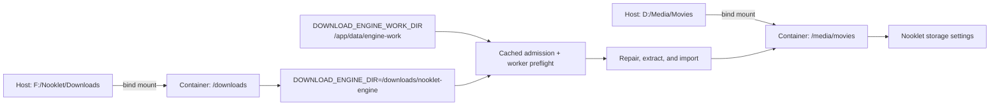

# Storage and path mapping

Nooklet uses three distinct storage stages:

1. **Download work** holds incomplete articles, assembled files, repairs, and extraction under `DOWNLOAD_ENGINE_WORK_DIR`.
2. **Completed-download staging** holds finalized output under `DOWNLOAD_ENGINE_DIR` until import succeeds.
3. **Final library destinations** hold imported movies and TV episodes.

The image defaults in-flight work to `/app/data/engine-work` on Docker's Linux-native named volume. This avoids high-concurrency random I/O on a Windows bind mount. A finalized result may still cross to `DOWNLOAD_ENGINE_DIR`, and import then crosses to its selected media destination.

## The Docker path model



Nooklet runs inside the container and cannot use `D:\Media\Movies` or `F:\...` directly. Configure the path on the **right-hand side** of each mount in Nooklet.

| Host folder            | Container path  | Nooklet configuration                               |
| ---------------------- | --------------- | --------------------------------------------------- |
| `D:/Media/Movies`      | `/media/movies` | Attach `/media/movies` as a movie folder            |
| `D:/Media/TV`          | `/media/tv`     | Attach `/media/tv` as a TV folder                   |
| `F:/Nooklet/Downloads` | `/downloads`    | Set `DOWNLOAD_ENGINE_DIR=/downloads/nooklet-engine` |

## Recommended Compose override

Create `docker-compose.override.yml`:

```yaml
services:
    app:
        volumes:
            - "D:/Media/Movies:/media/movies"
            - "D:/Media/TV:/media/tv"
            - "F:/Nooklet/Downloads:/downloads"
```

Use the equivalent absolute host paths on Linux or macOS. Then set:

```dotenv
APPROVED_MEDIA_ROOTS=/media
DOWNLOAD_ENGINE_DIR=/downloads/nooklet-engine
```

Recreate the container after any mount or environment change:

```bash
docker compose up -d --force-recreate
```

## Download capacity policy

Before the built-in engine accepts an NZB, it uses the latest fresh isolated-worker snapshot for the work and completed-output filesystems and reserves capacity for active work, extraction, and a safety floor. The web request never probes a mount directly. The worker checks operational state again before physical work.

```text
required free bytes
  = 512 MiB
  + sum(total bytes + remaining bytes for active built-in downloads)
  + (2 x declared bytes in the new NZB)
```

Free-space readings already exclude bytes downloaded so far. Each active item therefore reserves its remaining transfer plus one complete output/post-processing copy. The new item reserves both its assembled archive and an unpacked copy. The 512 MiB component is a fixed safety reserve.

Queue-time failures are classified before recovery acts:

- active-download contention waits and retries without consuming the release;
- a release larger than the entire staging filesystem is skipped in favor of another candidate;
- current non-active free-space pressure or a wrong/small volume mapping blocks with a storage repair action without excluding the release.

**Settings -> Storage** shows cached observations from the isolated storage probe:

- the configured and effective staging path;
- reachability and write access;
- raw free and total space;
- active-download reservation;
- capacity available for new downloads;
- the approximate maximum size of one additional download;
- snapshot freshness and the last completed check.

The probe normally runs every 60 seconds in a disposable process. If a mount call does not return within 30 seconds, the supervisor kills or abandons only that probe. The page retains the last successful capacity as stale instead of joining the blocked filesystem call.

Readiness requires the built-in workspace to be reachable, writable, and to have a positive amount available for new downloads. At queue time, the exact declared NZB size must also pass the formula.

## Diagnose “not enough free disk space”

1. Open **Settings -> Storage** and check whether the reading is fresh, stale, or unavailable.
2. Read the exact **download workspace** path; do not assume it is the final media folder.
3. Confirm `DOWNLOAD_ENGINE_DIR` uses the intended container mount, such as `/downloads/nooklet-engine`.
4. Confirm the host staging folder is actually bound to `/downloads`.
5. Check active downloads, because each reserves its remaining transfer plus a full output/post-processing copy.
6. Confirm the Nooklet container user can write to the mount.
7. Recreate the container if `.env` or the Compose override changed.
8. Recheck Storage and retry the request.

If `DOWNLOAD_ENGINE_DIR` is left at the image default `/app/data/downloads`, completed-download staging uses the Docker named-volume filesystem rather than an `F:` or other host media drive. `DOWNLOAD_ENGINE_WORK_DIR` should normally remain under `/app/data`; moving high-concurrency work to a Docker Desktop Windows bind mount can reintroduce host file-sharing pressure.

## Approved media roots

`APPROVED_MEDIA_ROOTS` defines the server-side trust boundary for scanning and file operations. Each attached library folder must:

- exist and resolve to a directory;
- be readable by Nooklet;
- remain inside an approved root after canonical path resolution;
- not be the filesystem root itself.

Separate multiple roots with semicolons or new lines:

```dotenv
APPROVED_MEDIA_ROOTS=/media;/archive/media
```

For Docker, an approved root alone does not create access. A matching volume mount must also exist.

## Final library destinations

Use **Settings -> Storage** to attach movie and TV folders and select default import destinations. A final destination is ready when it is reachable, readable, and writable. Nooklet evaluates movie and TV destinations separately, so a healthy movie folder does not make the TV request path ready.

Removing a folder configuration does not delete its existing media files. File deletions performed through supported workflows remain constrained to canonical files inside an approved, registered library.

## Permissions

The Docker image runs as its non-root `node` user. On Linux hosts, make the bind-mounted directories readable and writable by the effective container user without granting unnecessary access to the entire filesystem. Diagnose with host ownership/ACL tools and the latest snapshot shown in **Settings -> Storage**.

Avoid solving a permissions error by making the whole media tree world-writable. Grant the narrow service identity access required for staging and import.

## NAS and network storage

Mount network storage on the Docker host or operating system first, then bind a normal host directory into Nooklet. This gives the application a stable local/container path and lets canonical path checks operate normally.

For a native Windows process, UNC and device paths are rejected as media roots. Use an operating-system-mounted local path or run Nooklet in Docker with a host-managed NAS mount.

## Completed-output containment

Nooklet records finalized output under `DOWNLOAD_ENGINE_DIR`; there is no second downloader namespace or completed-path translation setting. Import validates the persisted completion path against the engine item's finalized directory and validates the destination against an active, approved library path. Keep the staging mount private to this Nooklet instance.

## Built-in data volume

Compose mounts the named volume `nooklet-data` at `/app/data`. The database always lives at `/app/data/nooklet.db` in Compose, regardless of a host-style `DATABASE_URL` in `.env`. The image-default in-flight workspace `/app/data/engine-work` and completed-output staging `/app/data/downloads` therefore persist across container recreation, but may share a smaller Docker-managed filesystem.

Do not run `docker compose down -v` unless intentionally deleting the persistent database volume.

## Implementation references

- [Compose volume model](https://github.com/TannerMidd/Nooklet/blob/main/docker-compose.yml)
- [Request-safe storage overview](https://github.com/TannerMidd/Nooklet/blob/main/src/modules/storage/queries/get-storage-overview.ts)
- [Isolated storage refresh](https://github.com/TannerMidd/Nooklet/blob/main/src/modules/storage/workflows/refresh-storage-snapshots.ts)
- [Queue-time capacity preflight](https://github.com/TannerMidd/Nooklet/blob/main/src/modules/download-engine/workflows/enqueue-nzb-download.ts)
- [Media-root policy](https://github.com/TannerMidd/Nooklet/blob/main/src/lib/security/filesystem-policy.ts)
- [Engine completion-path containment](https://github.com/TannerMidd/Nooklet/blob/main/src/modules/downloads/workflows/import-completed-downloads/source-path.ts)
