# Testing and CI

> Applies to the current `main` implementation. Last source review: 2026-08-06.

Nooklet uses documentation validators, dependency and migration policy checks, a module-boundary check, TypeScript, ESLint, Vitest, a Playwright browser smoke, a production Next.js build, and a hardened Docker smoke test as its verification ladder.

## Local verification

| Check                         | Command                                    | What it catches                                                                                                                                             |
| ----------------------------- | ------------------------------------------ | ----------------------------------------------------------------------------------------------------------------------------------------------------------- |
| Type safety                   | `npm run typecheck`                        | Type errors across application and tests                                                                                                                    |
| Static analysis               | `npm run lint`                             | ESLint and Next.js rule violations                                                                                                                          |
| Unit/integration tests        | `npm test`                                 | Domain, repository, adapter, route, and component-core behavior                                                                                             |
| Node script tests             | `npm run test:scripts`                     | Migration validator, module-boundary validator, storage probe, and worker watchdog behavior                                                                 |
| Browser smoke                 | `npm run test:e2e`                         | First-admin bootstrap, credentials login, stale-cookie rejection after sign-out, protected home navigation, and serious/critical axe violations in Chromium |
| Dependency advisory gate      | `npm run audit:dependencies`               | High/critical advisories in production dependencies                                                                                                         |
| Production build              | `npm run build`                            | App Router compilation and standalone bundle generation                                                                                                     |
| Wiki source                   | `npm run docs:wiki:check`                  | Required pages/headings, balanced fences, internal links/anchors, and current-main repository source targets                                                |
| Published documentation links | `npm run docs:links:check`                 | Missing current-main source targets and retired external-downloader names across README, docs, and the dossier                                              |
| Migration history             | `npm run migrations:check`                 | Contiguous journal indexes/tags, SQL artifact presence, timestamp policy, and explicit historical exceptions                                                |
| Module boundaries             | `npm run boundaries:check`                 | Cross-module production imports that bypass a target module's public API for repositories/adapters                                                          |
| Full repository check         | `npm run check`                            | Documentation/source links, migrations, boundaries, types, lint, infrastructure/application tests, and the production build                                 |
| Container smoke               | `docker build ...` plus health/tool probes | Image construction, startup, migrations, worker readiness, read-only hardening, and bundled yt-dlp/Node/ffmpeg availability                                 |

Source: [package scripts](https://github.com/TannerMidd/Nooklet/blob/main/package.json).

## Vitest environment

Tests are colocated with the code they cover using `*.test.ts` or `*.test.tsx`. [`vitest.setup.ts`](https://github.com/TannerMidd/Nooklet/blob/main/vitest.setup.ts) supplies a deterministic test-only `AUTH_SECRET`, replaces any ambient database URL with a fresh SQLite database in an isolated temporary directory, and restores the original process environment after the suite.

[`vitest.config.ts`](https://github.com/TannerMidd/Nooklet/blob/main/vitest.config.ts) maps the `@` alias to `src` and excludes `.next` so a prior production build cannot be collected as a duplicate copy of the tests.

Tests that mutate process environment or singleton state must restore it. Filesystem tests should use isolated temporary roots and must never point at operator media or download folders.

## What to test by change type

| Change                  | Minimum focused evidence                                                                                     |
| ----------------------- | ------------------------------------------------------------------------------------------------------------ |
| Schema/repository       | Migration plus read/write and ownership tests                                                                |
| Workflow                | Happy path, typed failure path, authorization/ownership, phase ordering where applicable                     |
| Server action/API route | Unauthenticated behavior, validation failure, success, safe error mapping                                    |
| External adapter        | Request construction, response validation, timeouts, safe failure text, SSRF behavior where applicable       |
| Filesystem/import       | Containment, symlink/traversal rejection, collision behavior, platform separators                            |
| Background job          | Claim eligibility, lease/run-token ownership, success/failure scheduling, retry semantics                    |
| Download engine         | Parser/CRC fixtures, fake NNTP transport, progress, recovery, unsafe archive entries                         |
| UI behavior             | Empty/loading/error/success states and accessible interaction semantics                                      |
| Accessibility           | Labeled semantics plus focused axe assertions; run the browser smoke for complete bootstrap/login navigation |
| Documentation           | Links, commands, generic examples, source claims, no private data                                            |

## GitHub Actions pipeline

The [CI workflow](https://github.com/TannerMidd/Nooklet/blob/main/.github/workflows/ci.yml) runs for pull requests and pushes to `main`.

The committed Dependabot configuration proposes weekly npm and GitHub Actions updates. CI still decides whether an update satisfies the lockfile, advisory, type, test, build, and container gates.

Dependency lifecycle scripts are denied unless their exact reviewed package version appears in `package.json#allowScripts`; `.npmrc` makes an unreviewed script a hard install failure. CI also publishes a CycloneDX production dependency SBOM. Publishing a GitHub Release with a valid SemVer tag and substantive required note sections runs the separate release workflow, which publishes the GHCR image with BuildKit SBOM and provenance attestations.

```mermaid
flowchart LR
  Checkout["Checkout"] --> Install["npm ci on Node 24"]
  Install --> Audit["Audit production dependencies"]
  Audit --> Docs["Validate Wiki + dossier + published source links"]
  Docs --> Migrations["Validate migration history"]
  Migrations --> Boundaries["Validate module boundaries"]
  Boundaries --> Lint["Lint"]
  Lint --> Types["Typecheck"]
  Types --> Tests["Vitest"]
  Tests --> Browser["Playwright + axe"]
  Browser --> Build["Standalone build"]
  Build --> Image["Build Docker image"]
  Image --> Smoke["Hardened container health smoke"]
```

The Docker job runs only after the application verification job succeeds. It builds the production image, starts it with:

- all Linux capabilities dropped;
- `no-new-privileges` enabled;
- a read-only root filesystem with bounded writable `tmpfs` mounts;
- PID and memory limits plus bounded JSON-file logs;
- generated test-only secrets;
- loopback-only dynamic port publication;
- an approved temporary media root.

It polls `/api/health` for up to 120 seconds and prints container logs if startup fails.

## Documentation publication

The [engineering dossier workflow](https://github.com/TannerMidd/Nooklet/blob/main/.github/workflows/engineering-dossier-pages.yml) validates and deploys the static dossier when its source changes. It rejects symlinks and common sensitive file types before uploading the Pages artifact.

The [Wiki publishing workflow](https://github.com/TannerMidd/Nooklet/blob/main/.github/workflows/publish-wiki.yml) runs when Wiki source, its validator, or the workflow itself changes on `main`; it can also be started manually. The job:

1. Runs `node scripts/validate-wiki.mjs` against the reviewed source.
2. Clones the repository's separate `.wiki.git` repository.
3. Replaces its Markdown pages with the files under `docs/wiki`.
4. Commits and pushes only when the synchronized content changed.

The Wiki validator requires `Home.md`, `_Sidebar.md`, and `_Footer.md`; rejects empty pages, unbalanced code fences, pages without a level-one heading, repository-relative links that will break in the separate Wiki repository, internal links/anchors without a matching target, and current-main repository links whose local source target is missing. The separate published-documentation validator applies the current-main source-target and retired-name checks across README, all docs, and the dossier. Neither validator proves that arbitrary external URLs respond or that Mermaid semantics render, so those remain review responsibilities.

GitHub Wiki content lives in a separate Git repository when published. The workflow keeps the reviewable source under `docs/wiki` on `main` and mirrors it rather than creating an unreviewed second authority. The repository Wiki must already be enabled and initialized for the clone step to succeed.

## What current CI proves

- Dependencies install under Node 24.
- Production dependencies pass the high-severity advisory gate.
- CI emits a CycloneDX production-dependency SBOM artifact retained for 14 days.
- Wiki, dossier/configurator, published source-link/name, migration-history, and module-boundary validators pass.
- TypeScript and ESLint pass.
- The Vitest suite, including focused component accessibility checks, passes against isolated SQLite state.
- Chromium captures the pre-sign-out HttpOnly session cookie, signs out, restores that stale cookie through Playwright's browser context, and confirms a direct protected navigation rejects it. The same flow also covers first-admin bootstrap, password sign-in, protected navigation, and serious/critical axe scans.
- The Next.js standalone bundle builds.
- The production image starts non-root with capabilities dropped, `no-new-privileges`, a read-only root filesystem, bounded writable tmpfs paths, PID/memory limits, and bounded container logs.
- Database initialization and worker readiness can satisfy the public health probe.

## What current CI does not prove

- A live request against real TMDB, AI, indexer, Usenet, Plex, Tautulli, Trakt, or notification services.
- Performance, sustained download throughput, or large-library scale.
- Multi-platform native downloader tooling behavior on Windows and macOS.
- Horizontal multi-process safety.
- Formal security, accessibility, or compliance certification; the axe smoke is focused evidence, not a certification.
- Cryptographic image signing; release images carry BuildKit SBOM/provenance attestations, but no separate signing key is configured.

Do not convert the existence of a CI workflow into a claim that branch protection is enabled; repository policy is separate from workflow source.

## Failure triage

1. Reproduce the failing command locally with the same Node major version.
2. Read the first causal error rather than later cascading failures.
3. For test failures, verify no local `DATABASE_URL` or mutable singleton escaped isolation.
4. For build-only failures, inspect server-imported environment validation and standalone trace inputs.
5. For Docker failures, inspect container logs and `/api/health`; distinguish application failure from Docker engine failure.
6. Fix the root cause and rerun the failed check plus any downstream checks it gates.

Related: [Development Guide](Development-Guide) | [Data and Background Jobs](Data-and-Background-Jobs) | [Troubleshooting](Troubleshooting)
